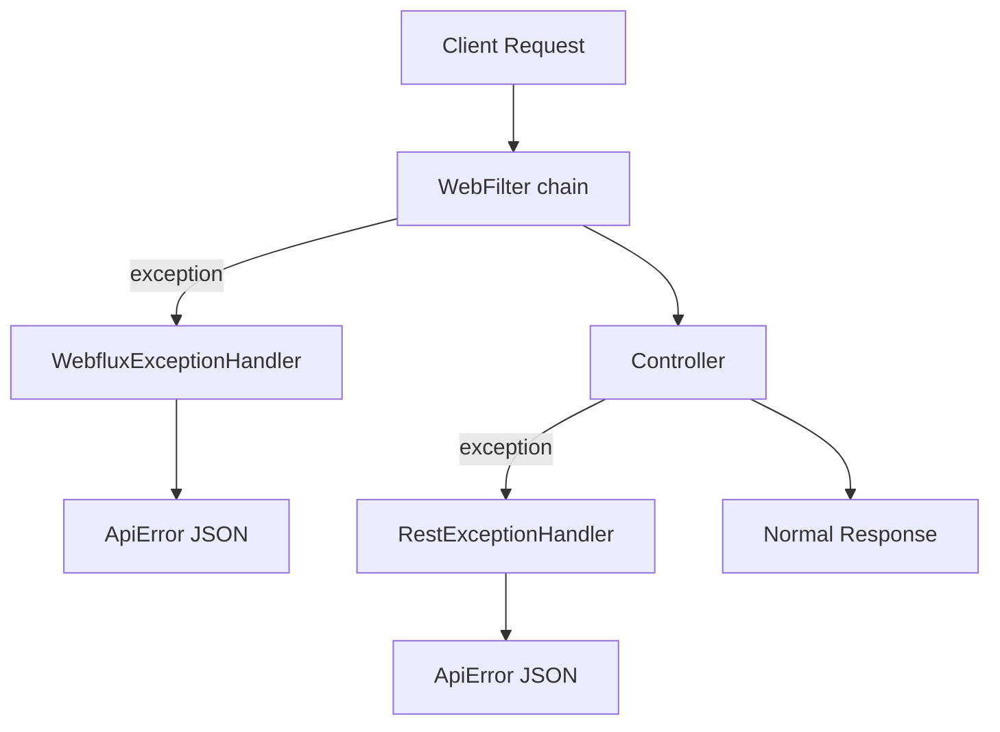

# exception-spring-boot-starter

[](https://www.apache.org/licenses/LICENSE-2.0)
[](https://mvnrepository.com/artifact/group.phorus/exception-spring-boot-starter)
[](https://codecov.io/gh/phorus-group/exception-spring-boot-starter)

Spring Boot WebFlux autoconfiguration for the Phorus exception-core library. Catches exceptions from
both controllers and WebFilters, converts them to structured JSON responses with proper HTTP status
codes, and provides built-in validation support, logging, metrics, and OpenAPI integration.

This starter depends on [exception-core](https://github.com/phorus-group/exception-core), which
provides the exception classes (`NotFound`, `BadRequest`, etc.). Adding this starter is enough
to get both.

### Notes

> The project runs a vulnerability analysis pipeline regularly,
> any found vulnerabilities will be fixed as soon as possible.

> The project dependencies are being regularly updated by [Renovate](https://github.com/phorus-group/renovate).

> The project has been thoroughly tested to ensure that it is safe to use in a production environment.

## Table of contents

- [Exception handling in Spring WebFlux](#exception-handling-in-spring-webflux)
- [Features](#features)
- [Getting started](#getting-started)
  - [Installation](#installation)
  - [Quick start](#quick-start)
- [Response format](#response-format)
  - [RFC 9457 alignment](#rfc-9457-alignment)
- [Exception classes](#exception-classes)
  - [Error codes](#error-codes)
  - [Reserved codes and HTTP class fallback](#reserved-codes-and-http-class-fallback)
- [Validation](#validation)
  - [Auto-derived per-field codes](#auto-derived-per-field-codes)
- [WebFilter exceptions](#webfilter-exceptions)
- [Logging](#logging)
- [Metrics](#metrics)
- [OpenAPI integration](#openapi-integration)
  - [`x-validations` OpenAPI extension](#x-validations-openapi-extension)
  - [Generating client validation from `x-validations`](#generating-client-validation-from-x-validations)
- [Building and contributing](#building-and-contributing)

---

## Exception handling in Spring WebFlux

If you are already familiar with this, feel free to skip to [Features](#features).

Spring WebFlux has two layers where exceptions can occur, and its default handling only
covers one of them.

`@RestControllerAdvice` catches exceptions thrown inside controller methods, but exceptions from
WebFilters (authentication filters, rate limiting, etc.) happen *before* the request reaches a
controller and bypass it entirely. Those produce generic framework responses with no structured
body.

On top of that, even for controller exceptions, Spring's default handling returns different formats
depending on the exception type. Validation errors, type mismatches, database constraint violations,
and business logic exceptions all produce different responses.

This library registers two handlers that cover both layers, converting every exception into a
consistent `ApiError` JSON response with the correct HTTP status code:



Everything is autoconfigured via Spring Boot's `META-INF/spring/org.springframework.boot.autoconfigure.AutoConfiguration.imports`.

## Features

- **Exception hierarchy**: throw `BadRequest("message")`, `NotFound("message")`, etc. and the correct HTTP status is set automatically. Extensible with custom subclasses.
- **Always present `code`**: every error response carries a non-null top-level `code`. When the exception sets one explicitly it is used as-is, otherwise the reserved fallback for the HTTP status (`BAD_REQUEST`, `NOT_FOUND`, etc.) is emitted.
- **Auto-derived per-field validation codes**: every `validationErrors[]` entry carries a `code` derived from the failing Jakarta constraint (`BLANK` for `@NotBlank`, `TOO_SHORT` or `TOO_LONG` for `@Size`, `INVALID_FORMAT` for `@Pattern`, etc.) and a `metadata` object with the constraint's public attributes (`min`, `max`, `regexp`).
- **OpenAPI `x-validations` extension**: every property annotated with Jakarta constraints is published in `/v3/api-docs` with an `x-validations` array describing the rule and reserved code for each constraint, so SDK generators and API consumers can read the per-field validation contract at generation time. Useful for generating FE schema validators (Zod, Yup, Valibot, Joi) that catch invalid input on the client without round-tripping to the BE, and for using the reserved codes as i18n keys to render translated, client-facing error messages. See [Generating client validation from `x-validations`](#generating-client-validation-from-x-validations).
- **Two-layer handling**: `RestExceptionHandler` catches controller exceptions, `WebfluxExceptionHandler` catches filter and framework exceptions
- **Bean validation**: supports `@Valid` on request bodies, collections, and Kotlin `suspend` functions with correct parameter names
- **Database conflict detection**: `DataIntegrityViolationException` is caught and returned as `409 Conflict`
- **Unhandled exception safety net**: any uncaught exception returns `500` with a generic message, no stack trace leak
- **Configurable logging**: all exceptions logged at debug level, unhandled exceptions at error level
- **Optional metrics**: exception counters via [metrics-commons](https://github.com/phorus-group/metrics-commons), enabled by default when Actuator is present
- **OpenAPI integration**: automatically registers `ApiError` and `ValidationError` schemas when springdoc is on the classpath
- **Autoconfigured**: all handlers and integrations are registered via Spring Boot autoconfiguration

## Getting started

### Installation

Make sure `mavenCentral()` is in your repository list.

<details open>
<summary>Gradle / Kotlin DSL</summary>

```kotlin
implementation("group.phorus:exception-spring-boot-starter:x.y.z")
```
</details>

<details open>
<summary>Maven</summary>

```xml
<dependency>
    <groupId>group.phorus</groupId>
    <artifactId>exception-spring-boot-starter</artifactId>
    <version>x.y.z</version>
</dependency>
```
</details>

### Quick start

Add the dependency and throw exceptions from your code:

```kotlin
@RestController
class UserController(private val userService: UserService) {

    @GetMapping("/user/{id}")
    suspend fun findById(@PathVariable id: UUID): UserResponse =
        userService.findById(id) ?: throw NotFound("User with id $id not found")

    @PostMapping("/user")
    suspend fun create(@RequestBody @Valid request: CreateUserRequest): ResponseEntity<Void> {
        val id = userService.create(request)
        return ResponseEntity.created(URI.create("/user/$id")).build()
    }
}
```

If the user is not found, the client receives:

```json
{
  "timestamp": "06-03-2026 10:30:00",
  "status": 404,
  "title": "Not Found",
  "detail": "User with id 550e8400-e29b-41d4-a716-446655440000 not found",
  "code": "NOT_FOUND"
}
```

If validation fails on the `@Valid` request body:

```json
{
  "timestamp": "06-03-2026 10:30:00",
  "status": 400,
  "title": "Bad Request",
  "detail": "Validation error",
  "code": "VALIDATION_FAILED",
  "validationErrors": [
    {
      "obj": "createUserRequest",
      "field": "email",
      "code": "BLANK",
      "rejectedValue": null,
      "message": "Cannot be blank"
    }
  ]
}
```

No additional configuration is needed.

## Response format

All error responses use `application/problem+json` content type and follow this structure:

| Field | Type | Description |
|-------|------|-------------|
| `status` | `int` | HTTP status code (e.g. `400`, `404`, `500`) |
| `title` | `string` | Short label for the HTTP status (e.g. `"Bad Request"`, `"Not Found"`) |
| `detail` | `string` | Human-readable explanation of this specific error |
| `code` | `string` | Application-specific error code for programmatic handling. Defaults to the reserved fallback for the HTTP status when the exception does not supply one. |
| `source` | `string?` | Service that produced the error (e.g. `"user-service"`). Auto-populated from `spring.application.name` by default. Omitted when null. |
| `metadata` | `object?` | Extra context as key-value pairs. Omitted when null. |
| `timestamp` | `string` | When the error occurred, formatted as `dd-MM-yyyy hh:mm:ss` |
| `validationErrors` | `array?` | Field-level validation details. Omitted when null. |

Each entry of `validationErrors[]` has the following shape:

| Field | Type | Description |
|-------|------|-------------|
| `obj` | `string` | The bean that failed validation (e.g. `"createUserRequest"`) |
| `field` | `string?` | The field path that failed (e.g. `"email"` or `"subObject.testVar"`). Omitted for global errors. |
| `code` | `string?` | Reserved code derived from the failing Jakarta constraint (`BLANK`, `TOO_SHORT`, `INVALID_EMAIL`, etc.). Omitted when the constraint type is not in the mapping table. |
| `rejectedValue` | `any?` | The rejected value. Omitted when null. |
| `message` | `string?` | The validation message |
| `metadata` | `object?` | Public attributes of the failing constraint (`min`, `max`, `regexp`, etc.). Omitted when the constraint carries no public attributes. |

### RFC 9457 alignment

The response structure follows [RFC 9457 (Problem Details for HTTP APIs)](https://www.rfc-editor.org/rfc/rfc9457.html)
naming conventions. The `status`, `title`, and `detail` fields match the RFC specification.

The following RFC 9457 fields were intentionally excluded:

| RFC field | Why excluded |
|-----------|-------------|
| `type` (URI) | Intended as a dereferenceable link to documentation for the error type. In practice, most APIs never host these URIs. The `code` field serves the same programmatic identification purpose with less overhead. |
| `instance` (URI) | Identifies the specific occurrence (e.g. a request path or trace ID). The request path is already in the HTTP request, and trace IDs are better handled by distributed tracing infrastructure. |

The `code`, `source`, `metadata`, `timestamp`, and `validationErrors` fields are extensions,
which is explicitly supported by the RFC.

### Auto-populated source

When `spring.application.name` is set, the `source` field is automatically included in every
error response. This is useful in microservice architectures where errors may be forwarded or
logged by gateways. Exceptions that set `source` explicitly override the default.

To disable auto-population:

```yaml
group:
  phorus:
    exception:
      include-source: false
```

## Exception classes

The exception classes (`BadRequest`, `NotFound`, `Conflict`, etc.) are provided by
[exception-core](https://github.com/phorus-group/exception-core), which is a transitive
dependency of this starter.

All exceptions extend `BaseException(message, statusCode)` which extends `RuntimeException`.
They can be thrown from controllers, services, WebFilters, or anywhere in your code. The
handlers catch them and return the correct HTTP status code automatically.

`BaseException` is extensible. You can create custom subclasses for HTTP statuses not covered
by the 16 built-in types. See the [exception-core README](https://github.com/phorus-group/exception-core#custom-exception-classes)
for details.

### Error codes

Every exception accepts an optional `code` parameter. When provided, the value is used
verbatim. When omitted, the reserved fallback for the HTTP status is used (see
[Reserved codes and HTTP class fallback](#reserved-codes-and-http-class-fallback) below).
The top level `code` property in the response is therefore always present.

```kotlin
throw BadRequest("Email format is invalid", code = "VALIDATION_EMAIL")
```

Response (assuming `spring.application.name=user-service`):

```json
{
  "timestamp": "22-03-2026 07:30:00",
  "status": 400,
  "title": "Bad Request",
  "detail": "Email format is invalid",
  "code": "VALIDATION_EMAIL",
  "source": "user-service"
}
```

Without an explicit code:

```kotlin
throw BadRequest("Email format is invalid")
```

```json
{
  "timestamp": "22-03-2026 07:30:00",
  "status": 400,
  "title": "Bad Request",
  "detail": "Email format is invalid",
  "code": "BAD_REQUEST",
  "source": "user-service"
}
```

With metadata:

```kotlin
throw NotFound(
    "User not found",
    code = "USER_NOT_FOUND",
    metadata = mapOf("userId" to requestedId),
)
```

Optional fields (`source`, `metadata`) are omitted from the JSON when `null`.
See the [exception-core README](https://github.com/phorus-group/exception-core#error-codes)
for more examples.

### Reserved codes and HTTP class fallback

When an exception is thrown without an explicit `code`, the handler emits a reserved
constant from `ReservedErrorCodes` based on the HTTP status. The mapping is:

| Source | Top-level `code` |
|---|---|
| `throw BadRequest("...", code = "BUDGET_NAME_TAKEN")` | `BUDGET_NAME_TAKEN` |
| `throw BadRequest("...")` no code argument | `BAD_REQUEST` |
| `throw NotFound("...")` no code argument | `NOT_FOUND` |
| `throw Conflict("...")` no code argument | `CONFLICT` |
| `@Valid` validation failure | `VALIDATION_FAILED` |
| Uncaught exception that becomes 500 | `INTERNAL_SERVER_ERROR` |
| `DataIntegrityViolationException` mapped to 409 | `CONFLICT` |

The full list of reserved constants is documented in
[exception-core](https://github.com/phorus-group/exception-core#reserved-error-codes).

## Validation

Use `@Valid` on request body parameters with Jakarta validation annotations on your DTOs:

```kotlin
data class CreateUserRequest(
    @field:NotBlank(message = "Cannot be blank")
    val name: String?,

    @field:NotBlank(message = "Cannot be blank")
    @field:Email(message = "Invalid email format")
    val email: String?,

    @field:NotEmpty(message = "Cannot be empty")
    val subObjectList: List<SubObject>?,
)

@PostMapping("/user")
suspend fun create(@RequestBody @Valid request: CreateUserRequest) = ...
```

All validation errors are collected at once and returned in a single response. The library validates
every field, every nested object, and every collection item, then reports all violations together:

```json
{
  "timestamp": "06-03-2026 10:30:00",
  "status": 400,
  "title": "Bad Request",
  "detail": "Validation error",
  "code": "VALIDATION_FAILED",
  "validationErrors": [
    {
      "obj": "createUserRequest",
      "field": "name",
      "code": "BLANK",
      "rejectedValue": "",
      "message": "Cannot be blank"
    },
    {
      "obj": "createUserRequest",
      "field": "email",
      "code": "BLANK",
      "rejectedValue": null,
      "message": "Cannot be blank"
    },
    {
      "obj": "createUserRequest",
      "field": "subObjectList",
      "code": "REQUIRED",
      "rejectedValue": [],
      "message": "Cannot be empty"
    }
  ]
}
```

Collections are also supported. Add `@Validated` to the controller class and `@Valid` to the
collection parameter:

```kotlin
@RestController
@Validated
class ItemController {

    @PostMapping("/items")
    suspend fun createBatch(
        @RequestBody @Valid @NotEmpty(message = "Cannot be empty")
        items: List<ItemDTO>,
    ): List<ItemResponse> = ...
}
```

The library also fixes Spring's parameter name discovery for Kotlin `suspend` functions. Spring's
default resolver gets confused by the continuation parameter, which breaks validation annotations
on suspend controller methods. The library's `WebfluxValidatorConfig` handles this transparently.

### Auto-derived per-field codes

Every entry in `validationErrors[]` carries a `code` derived from the failing Jakarta
constraint annotation, plus a `metadata` object with the constraint's public attributes
(`min`, `max`, `regexp`, etc.). No extra annotation is required.

```kotlin
data class TransactionPatchRequest(
    @field:Size(min = 1, max = 500)
    val description: String?,

    @field:NotNull(message = "Cannot be null")
    val amount: BigDecimal?,
)
```

A request with a 600-character description produces:

```json
{
  "timestamp": "06-03-2026 10:30:00",
  "status": 400,
  "title": "Bad Request",
  "detail": "Validation error",
  "code": "VALIDATION_FAILED",
  "validationErrors": [
    {
      "obj": "transactionPatchRequest",
      "field": "description",
      "code": "TOO_LONG",
      "rejectedValue": "...",
      "message": "size must be between 1 and 500",
      "metadata": { "min": 1, "max": 500 }
    }
  ]
}
```

The mapping table is below. The full list of reserved constants is documented in
[exception-core](https://github.com/phorus-group/exception-core#reserved-error-codes).

| Jakarta constraint | Per-field `code` |
|---|---|
| `@NotNull`, `@NotEmpty` | `REQUIRED` |
| `@NotBlank` | `BLANK` |
| `@Null` | `MUST_BE_NULL` |
| `@Size` or `@Length` (Hibernate) below `min` | `TOO_SHORT` |
| `@Size` or `@Length` (Hibernate) above `max` | `TOO_LONG` |
| `@Min`, `@DecimalMin`, `@Range` (Hibernate) below `min` | `TOO_SMALL` |
| `@Max`, `@DecimalMax`, `@Range` (Hibernate) above `max` | `TOO_LARGE` |
| `@Positive` | `MUST_BE_POSITIVE` |
| `@PositiveOrZero` | `MUST_BE_POSITIVE_OR_ZERO` |
| `@Negative` | `MUST_BE_NEGATIVE` |
| `@NegativeOrZero` | `MUST_BE_NEGATIVE_OR_ZERO` |
| `@Digits` | `INVALID_NUMBER_FORMAT` |
| `@Pattern` | `INVALID_FORMAT` |
| `@Email` | `INVALID_EMAIL` |
| `@Past` | `MUST_BE_PAST` |
| `@PastOrPresent` | `MUST_BE_PAST_OR_PRESENT` |
| `@Future` | `MUST_BE_FUTURE` |
| `@FutureOrPresent` | `MUST_BE_FUTURE_OR_PRESENT` |
| `@AssertTrue` | `MUST_BE_TRUE` |
| `@AssertFalse` | `MUST_BE_FALSE` |

For `@Size`, `@Length`, and `@Range` the directional code is selected at runtime by
inspecting the rejected value. Custom constraint annotations not in the table emit no
`code` (the property is omitted from the JSON entry) and no `metadata`. Nested validation
paths (`subObject.testVar`) and indexed collection paths (`items[0].name`) are supported.

## WebFilter exceptions

`@RestControllerAdvice` only catches exceptions thrown inside controller methods. Exceptions from
WebFilters happen before the request reaches a controller, so they bypass it entirely.

The library's `WebfluxExceptionHandler` (registered with `@Order(-2)`) catches these and returns
the same `ApiError` JSON:

```kotlin
@Component
class AuthenticationFilter : WebFilter {
    override fun filter(exchange: ServerWebExchange, chain: WebFilterChain): Mono<Void> {
        val authHeader = exchange.request.headers.getFirst("Authorization")
            ?: throw Unauthorized("Authorization header is missing")

        if (!hasRequiredPermissions(parseToken(authHeader))) {
            throw Forbidden("Insufficient permissions")
        }

        return chain.filter(exchange)
    }
}
```

Without the library, these exceptions would produce generic framework responses. With it, the
client receives structured JSON:

```json
{
  "timestamp": "06-03-2026 10:30:00",
  "status": 401,
  "title": "Unauthorized",
  "detail": "Authorization header is missing",
  "code": "UNAUTHORIZED"
}
```

## Logging

All caught exceptions are logged before being returned to the client. Business exceptions
(`BaseException`, validation errors, type mismatches) are logged at **debug** level. Unhandled
exceptions that fall through to the generic `Exception` handler are logged at **error** level
with full stack traces.

Configure the log level with:

```yaml
logging:
  level:
    group.phorus.exception: DEBUG
```

## Metrics

The library integrates with [metrics-commons](https://github.com/phorus-group/metrics-commons) to
record exception counters. Every caught exception increments a counter named
`http.server.exceptions` with the following tags:

| Tag | Example values |
|-----|---------------|
| `type` | `NotFound`, `BadRequest`, `RuntimeException` |
| `status_code` | `404`, `400`, `500` |
| `status_family` | `4xx`, `5xx` |

Metrics are **enabled by default** when `MeterRegistry` is on the classpath (via Spring Boot
Actuator). To disable them:

```yaml
group:
  phorus:
    exception:
      metrics:
        enabled: false
```

## OpenAPI integration

If [springdoc-openapi](https://springdoc.org/) is on the classpath, the library automatically
registers `ApiError` and `ValidationError` schemas in the OpenAPI components and adds a
`default` error response to every endpoint. This covers all error status codes with a single
entry referencing the `ApiError` schema.

### `x-validations` OpenAPI extension

The library registers a `PropertyCustomizer` bean that publishes every Jakarta constraint
annotation on a property as an entry in an `x-validations` array on the schema. Each entry
has shape `{ "rule": "<name>", "code": "<RESERVED_CODE>" }`. SDK generators, API gateways,
and contract tooling can read the per-field validation contract straight from the published
OpenAPI document.

For the example DTO

```kotlin
data class TransactionPatchRequest(
    @field:NotBlank
    @field:Size(min = 1, max = 500)
    @field:Pattern(regexp = "[A-Z0-9]+")
    val name: String?,
)
```

the generated schema looks like this:

```yaml
TransactionPatchRequest:
  type: object
  properties:
    name:
      type: string
      minLength: 1
      maxLength: 500
      pattern: "[A-Z0-9]+"
      x-validations:
        - rule: notBlank
          code: BLANK
        - rule: minLength
          code: TOO_SHORT
        - rule: maxLength
          code: TOO_LONG
        - rule: pattern
          code: INVALID_FORMAT
```

The `rule` vocabulary follows JSON Schema where one exists and falls back to a synthetic
name otherwise.

| `rule` | Source | Notes |
|---|---|---|
| `required` | `@NotNull` | synthetic |
| `notBlank` | `@NotBlank` | synthetic |
| `null` | `@Null` | synthetic |
| `minLength` / `maxLength` | `@Size` or `@Length` on string. `@NotEmpty` on string also emits `minLength`. | JSON Schema |
| `minItems` / `maxItems` | `@Size` on array. `@NotEmpty` on array also emits `minItems`. | JSON Schema |
| `minProperties` / `maxProperties` | `@Size` on object. `@NotEmpty` on object also emits `minProperties`. | JSON Schema |
| `minimum` / `maximum` | `@Min`, `@Max`, `@DecimalMin`, `@DecimalMax`, `@Range`, `@PositiveOrZero` (only `minimum`), `@NegativeOrZero` (only `maximum`) | JSON Schema |
| `exclusiveMinimum` / `exclusiveMaximum` | `@Positive`, `@Negative` | JSON Schema |
| `pattern` | `@Pattern` | JSON Schema |
| `format` | `@Email` | JSON Schema |
| `digits` | `@Digits` | synthetic |
| `past` / `pastOrPresent` / `future` / `futureOrPresent` | temporal constraints | synthetic |
| `assertTrue` / `assertFalse` | `@AssertTrue`, `@AssertFalse` | synthetic |

Properties carrying no recognized constraint annotation emit no `x-validations` key. The
bean is conditional on the `org.springdoc.core.customizers.OpenApiCustomizer` class being
on the classpath, which matches the existing OpenAPI integration.

Annotations are emitted in source declaration order. When two annotations would produce
the same `rule` (for example writing `@Min(0)` together with `@PositiveOrZero`), only the
first declared one is kept.

### Generating client validation from `x-validations`

The `x-validations` array enables two patterns. The first is generating FE schema
validators that catch invalid input on the client without round-tripping to the BE. The
second is using the reserved codes as i18n keys, so client-facing error messages can be
translated and rendered in the user's language regardless of which side caught the
failure. Both patterns rely on the same fact, the codes that the FE schema validator
emits are the codes the BE returns on `validationErrors[].code`, so a single translation
table from code to localized message covers both paths.

The walkthrough below uses [Orval](https://orval.dev/) to autogenerate
[Zod](https://zod.dev/) schemas. The same approach applies to other schema validators
that accept a custom message argument such as Yup, Valibot, and Joi, swap the Zod
specific bits for the equivalent in your library of choice.

#### 1. Write the DTO with Jakarta constraints

Annotations only, no extra config, the library autoconfigures the rest.

```kotlin
// src/main/kotlin/.../user/CreateUserRequest.kt
data class CreateUserRequest(
    @field:NotBlank
    @field:Size(min = 2, max = 50)
    val name: String?,
)
```

springdoc auto-publishes the DTO at `/v3/api-docs` with the `x-validations`
extension wired alongside the standard JSON Schema validators.

<details>
<summary>OpenAPI fragment</summary>

```yaml
CreateUserRequest:
  type: object
  required:
    - name
  properties:
    name:
      type: string
      minLength: 2
      maxLength: 50
      x-validations:
        - rule: notBlank
          code: BLANK
        - rule: minLength
          code: TOO_SHORT
        - rule: maxLength
          code: TOO_LONG
```

</details>

#### 2. Configure Orval and chain the post-processor

Configure Orval to read the BE OpenAPI doc and emit a Zod schema file.

```ts
// orval.config.ts
import { defineConfig } from 'orval';

export default defineConfig({
  api: {
    input: { target: 'http://localhost:8080/v3/api-docs' },
    output: {
      target: 'src/api/generated/api.zod.ts',
      client: 'zod',
      mode: 'single',
    },
  },
});
```

Running `yarn orval` produces this:

```ts
// src/api/generated/api.zod.ts (raw Orval output)
export const createUserRequest = zod.strictObject({
  "name": zod.string().min(2).max(50),
});
```

Each Zod validator like `.min(N)` takes an optional second argument that
becomes the error message Zod attaches to the issue when that validator
fails. Orval emitted the validator values (`2`, `50`) read from
`minLength` and `maxLength` in the JSON Schema, but no message. When
validation fails Zod will fall back to its built-in English ("String must
contain at least 2 character(s)") instead of the reserved code we want.
Orval has no per-validator message hook, so the codes from `x-validations`
are ignored entirely, and the FE-side messages diverge from the BE-side
codes that the single-vocabulary contract depends on.

A small post-processor closes the gap. It walks the generated file and
rewrites each un-messaged call to carry the matching reserved code as its
second argument, reading the rule-to-code mapping straight from the OpenAPI
doc's `x-validations`.

<details>
<summary>scripts/inject-zod-messages.cjs</summary>

```js
"use strict";
const { readFileSync, writeFileSync } = require("node:fs");
const { resolve } = require("node:path");

const RULE_TO_CODE = {
  // Required / nullness
  notBlank: "BLANK",
  null: "MUST_BE_NULL",
  required: "REQUIRED",
  // Size on string
  minLength: "TOO_SHORT",
  maxLength: "TOO_LONG",
  // Size on collection
  minItems: "REQUIRED",
  maxItems: "TOO_LONG",
  // Size on map
  minProperties: "REQUIRED",
  maxProperties: "TOO_LONG",
  // Numeric range
  minimum: "TOO_SMALL",
  maximum: "TOO_LARGE",
  exclusiveMinimum: "MUST_BE_POSITIVE",
  exclusiveMaximum: "MUST_BE_NEGATIVE",
  // Format
  pattern: "INVALID_FORMAT",
  format: "INVALID_EMAIL",
  digits: "INVALID_NUMBER_FORMAT",
  // Time
  past: "MUST_BE_PAST",
  pastOrPresent: "MUST_BE_PAST_OR_PRESENT",
  future: "MUST_BE_FUTURE",
  futureOrPresent: "MUST_BE_FUTURE_OR_PRESENT",
  // Boolean
  assertTrue: "MUST_BE_TRUE",
  assertFalse: "MUST_BE_FALSE",
};

function rewriteCalls(source, method, code) {
  const re = new RegExp(
    `\\.${method}\\((-?\\d+(?:\\.\\d+)?|[A-Za-z_$][A-Za-z0-9_$]*)\\)`,
    "g",
  );
  return source.replace(re, (_match, arg) => `.${method}(${arg}, "${code}")`);
}

function injectMessages(source, codes) {
  let out = source;
  out = rewriteCalls(out, "min", codes.minLength);
  out = rewriteCalls(out, "max", codes.maxLength);
  out = rewriteCalls(out, "gte", codes.minimum);
  out = rewriteCalls(out, "lte", codes.maximum);
  out = rewriteCalls(out, "gt", codes.exclusiveMinimum);
  out = rewriteCalls(out, "lt", codes.exclusiveMaximum);
  out = out.replace(
    /\.regex\((\/(?:\\.|[^/\\])+\/[gimsuy]*)\)/g,
    (_match, regexLiteral) => `.regex(${regexLiteral}, "${codes.pattern}")`,
  );
  out = out.replace(/\.email\(\)/g, `.email("${codes.format}")`);
  return out;
}

const repoRoot = resolve(__dirname, "..");
const zodPath = resolve(repoRoot, "src/api/generated/api.zod.ts");
const source = readFileSync(zodPath, "utf8");
const rewritten = injectMessages(source, RULE_TO_CODE);
if (rewritten !== source) writeFileSync(zodPath, rewritten, "utf8");
```

</details>

Wire the post-processor into the codegen step so it runs every time the FE
regenerates the client.

```json
// package.json
{
  "scripts": {
    "api:generate": "orval --config orval.config.ts && yarn api:inject-codes",
    "api:inject-codes": "node scripts/inject-zod-messages.cjs"
  }
}
```

After `yarn api:generate` runs, the same generated file now carries the
reserved codes as the Zod method's second argument.

```ts
// src/api/generated/api.zod.ts (after the post-processor)
export const createUserRequest = zod.strictObject({
  "name": zod.string().min(2, "TOO_SHORT").max(50, "TOO_LONG"),
});
```

The mapping from `rule` to Zod method follows the JSON Schema vocabulary,
`minLength` becomes `.min(N, code)`, `pattern` becomes `.regex(re, code)`,
`format: email` becomes `.email(code)`, and so on. Synthetic rules without
a JSON Schema cousin (`notBlank`, `past`, `assertTrue`, etc.) need an
explicit `.refine(predicate, code)` injection that the post-processor can
insert when needed.

#### 3. Add the i18n templates and translator helper

The templates are next-intl messages keyed by reserved code. The translator
hook normalizes Zod's `issue.params` shape (`{minimum, maximum, pattern}`)
and the BE's `validationErrors[].metadata` shape (`{min, max, regexp}`) onto
the same ICU view, so one template renders cleanly from either source.

```json
// src/i18n/messages/en.json
{
  "errors": {
    "BLANK": "{field} cannot be blank.",
    "REQUIRED": "{field} is required.",
    "TOO_SHORT": "{field} must be at least {min} characters.",
    "TOO_LONG": "{field} must be at most {max} characters.",
    "TOO_SMALL": "{field} must be at least {min}.",
    "TOO_LARGE": "{field} must be at most {max}.",
    "INVALID_FORMAT": "{field} format is invalid.",
    "INVALID_EMAIL": "{field} must be a valid email address.",
    "MUST_BE_POSITIVE": "{field} must be greater than zero.",
    "MUST_BE_PAST": "{field} must be a past date."
  }
}
```

<details>
<summary>src/lib/validation-errors.ts</summary>

```ts
"use client";
import { useTranslations } from "next-intl";

export interface ValidationParams {
  min?: number | string;
  minimum?: number | string;  // Zod issue.params shape
  max?: number | string;
  maximum?: number | string;  // Zod issue.params shape
  regexp?: string;
  pattern?: string;           // Zod issue.params shape
  [k: string]: unknown;
}

function normalise(field: string, params?: ValidationParams) {
  const view: Record<string, string | number> = { field };
  if (params) {
    view.min = (params.min ?? params.minimum) as string | number;
    view.max = (params.max ?? params.maximum) as string | number;
    view.regexp = String(params.regexp ?? params.pattern ?? "");
  }
  return view;
}

export function useValidationTranslator() {
  const t = useTranslations("errors");
  return (code: string | undefined, field: string, params?: ValidationParams) => {
    if (!code) return t("generic");
    if (!t.has(code)) return code;
    return t(code, normalise(field, params));
  };
}
```

</details>

#### 4. Use the generated schema in a form

```tsx
"use client";
import { useForm } from "react-hook-form";
import { zodResolver } from "@hookform/resolvers/zod";
import { createUserRequest } from "@/api/generated/api.zod";
import {
  useValidationTranslator,
  type ValidationParams,
} from "@/lib/validation-errors";

type FormValues = { name: string; email: string };

export function NewUserForm() {
  const translate = useValidationTranslator();
  const form = useForm<FormValues>({
    resolver: zodResolver(createUserRequest),
  });

  // Each RHF issue has `message` (the reserved code we passed as the Zod
  // method's second argument) and the matching Zod params (minimum, maximum,
  // pattern). Pass both to the translator and get back the localised text.
  const nameIssue = form.formState.errors.name;
  const emailIssue = form.formState.errors.email;

  function save(values: FormValues) {
    // POST /user with the validated body
  }

  return (
    <form onSubmit={form.handleSubmit(save)}>
      <label>
        Name
        <input {...form.register("name")} />
      </label>
      {nameIssue && (
        <span role="alert">
          {translate(
            nameIssue.message,
            "Name",
            nameIssue as unknown as ValidationParams,
          )}
        </span>
      )}

      <label>
        Email
        <input {...form.register("email")} />
      </label>
      {emailIssue && (
        <span role="alert">
          {translate(
            emailIssue.message,
            "Email",
            emailIssue as unknown as ValidationParams,
          )}
        </span>
      )}

      <button type="submit">Save</button>
    </form>
  );
}
```

#### 5. Same code, same render, both directions

What happens when the user types `"x"` into Name and tabs out:

1. RHF runs `zodResolver(createUserRequest)`.
2. Zod fires `.min(2, "TOO_SHORT")` on the `name` field.
3. RHF stores the issue at `form.formState.errors.name` with
   `message: "TOO_SHORT"` and `minimum: 2`, `type: "string"`.
4. The render code calls `translate("TOO_SHORT", "Name", nameIssue)`.
5. The translator looks up `errors.TOO_SHORT` in `en.json`, gets the template
   `"{field} must be at least {min} characters."`.
6. It normalizes the params (Zod's `minimum` becomes `view.min`) and
   interpolates `{field}` and `{min}`.
7. The `<span>` renders:

> Name must be at least 2 characters.

If the user uses curl to bypass the FE validator, the BE catches the same
constraint via Jakarta and returns:

```json
{
  "status": 400,
  "code": "VALIDATION_FAILED",
  "validationErrors": [
    {
      "obj": "createUserRequest",
      "field": "name",
      "code": "TOO_SHORT",
      "rejectedValue": "x",
      "message": "size must be between 2 and 50",
      "metadata": { "min": 2, "max": 50 }
    }
  ]
}
```

The `save` function from Step 4 is where this happens. Replace its empty
placeholder body with a real fetch, iterate `validationErrors[]` from the
response, call the same translator with each entry's `metadata` (instead of
Zod's `issue.params`), and feed the result back into RHF via
`form.setError`. RHF stores it on the same `form.formState.errors[field]`
slot the Step 4 `<span>` already reads from, so the BE-derived message
surfaces through the existing render path with no extra wiring.

```ts
import { extractValidationErrors } from "@/lib/api-error";

const labels: Record<keyof FormValues, string> = { name: "Name", email: "Email" };

// This would be the same `save` passed to `form.handleSubmit(save)` in Step 4.
async function save(values: FormValues) {
  const res = await fetch("/user", {
    method: "POST",
    headers: { "Content-Type": "application/json" },
    body: JSON.stringify(values),
  });
  if (res.ok) return;
  for (const entry of extractValidationErrors(await res.json())) {
    const field = entry.field as keyof FormValues;
    form.setError(field, {
      message: translate(entry.code, labels[field], entry.metadata),
    });
  }
}
```

The translator looks up `errors.TOO_SHORT` again, normalises `metadata.min`
into `view.min`, RHF surfaces the message on the same `nameIssue` slot, and
the user sees the **same** text as the FE-side path:

> Name must be at least 2 characters.

One vocabulary, one i18n table, two sources of failure, and an identical render.

#### 6. Without i18n, drop next-intl and use a static helper

In case your project does not use `next-intl`, the translator collapses into a
plain TypeScript module with the templates baked in. The shape of the call
site is identical, callers swap `useValidationTranslator()` for
`translateValidation` and the rest of the form code is unchanged.

```ts
// src/lib/validation-errors.ts
export interface ValidationParams {
  min?: number | string;
  minimum?: number | string;
  max?: number | string;
  maximum?: number | string;
  regexp?: string;
  pattern?: string;
}

const STATIC_EN: Record<string, string> = {
  BLANK: "{field} cannot be blank.",
  REQUIRED: "{field} is required.",
  MUST_BE_NULL: "{field} must be empty.",
  TOO_SHORT: "{field} must be at least {min} characters.",
  TOO_LONG: "{field} must be at most {max} characters.",
  TOO_SMALL: "{field} must be at least {min}.",
  TOO_LARGE: "{field} must be at most {max}.",
  MUST_BE_POSITIVE: "{field} must be greater than zero.",
  MUST_BE_POSITIVE_OR_ZERO: "{field} cannot be negative.",
  MUST_BE_NEGATIVE: "{field} must be less than zero.",
  MUST_BE_NEGATIVE_OR_ZERO: "{field} cannot be positive.",
  INVALID_NUMBER_FORMAT: "{field} is not a valid number.",
  INVALID_FORMAT: "{field} format is invalid.",
  INVALID_EMAIL: "{field} must be a valid email address.",
  MUST_BE_PAST: "{field} must be a past date.",
  MUST_BE_PAST_OR_PRESENT: "{field} cannot be in the future.",
  MUST_BE_FUTURE: "{field} must be a future date.",
  MUST_BE_FUTURE_OR_PRESENT: "{field} cannot be in the past.",
  MUST_BE_TRUE: "{field} must be checked.",
  MUST_BE_FALSE: "{field} must be unchecked.",
  VALIDATION_FAILED: "Some fields are invalid.",
};

function normalise(field: string, params?: ValidationParams) {
  const view: Record<string, string | number> = { field };
  if (params) {
    const min = params.min ?? params.minimum;
    const max = params.max ?? params.maximum;
    const regexp = params.regexp ?? params.pattern;
    if (min !== undefined) view.min = min;
    if (max !== undefined) view.max = max;
    if (regexp !== undefined) view.regexp = String(regexp);
  }
  return view;
}

function interpolate(template: string, view: Record<string, string | number>): string {
  return template.replace(/\{(\w+)\}/g, (_match, key) => {
    const value = view[key];
    return value === undefined ? "" : String(value);
  });
}

export function translateValidation(
  code: string | undefined,
  field: string,
  params?: ValidationParams,
): string {
  if (!code) return STATIC_EN.VALIDATION_FAILED;
  const template = STATIC_EN[code];
  if (!template) return code;
  return interpolate(template, normalise(field, params));
}
```

The form uses it the same way.

```tsx
import { translateValidation } from "@/lib/validation-errors";
// ...
{nameIssue && (
  <span role="alert">
    {translateValidation(nameIssue.message, "Name", nameIssue as never)}
  </span>
)}
```

Same call shape as the i18n version, same input arguments, same output text.
The only thing that changes is whether `STATIC_EN` lives in the module or
gets pulled from a JSON file by `useTranslations`. Adding a second locale
later means swapping `translateValidation` back to a hook that reads from
`next-intl`.

## Building and contributing

See [Contributing Guidelines](CONTRIBUTING.md).

## Authors and acknowledgment

Developed and maintained by the [Phorus Group](https://phorus.group) team.
