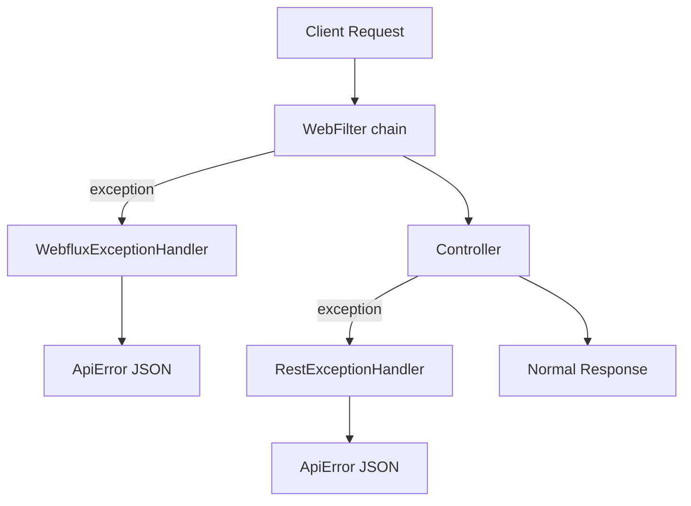
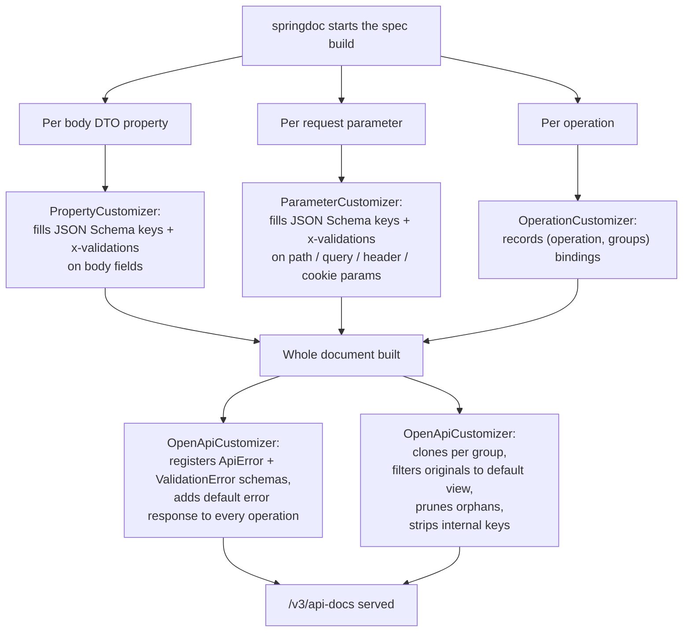

# exception-spring-boot-starter

[](https://www.apache.org/licenses/LICENSE-2.0)
[](https://mvnrepository.com/artifact/group.phorus/exception-spring-boot-starter)
[](https://codecov.io/gh/phorus-group/exception-spring-boot-starter)

Spring Boot WebFlux autoconfiguration for the Phorus exception-core library. Catches exceptions from
both controllers and WebFilters, converts them to structured JSON responses with proper HTTP status
codes, and provides built-in validation support, logging, metrics, and OpenAPI integration.

This starter depends on [exception-core](https://github.com/phorus-group/exception-core), which
provides the exception classes (`NotFound`, `BadRequest`, etc.). Adding this starter is enough
to get both.

### Notes

> The project runs a vulnerability analysis pipeline regularly,
> any found vulnerabilities will be fixed as soon as possible.

> The project dependencies are being regularly updated by [Renovate](https://github.com/phorus-group/renovate).

> The project has been thoroughly tested to ensure that it is safe to use in a production environment.

## Table of contents

- [Exception handling in Spring WebFlux](#exception-handling-in-spring-webflux)
- [How exception handling works](#how-exception-handling-works)
  - [Controller layer](#controller-layer)
  - [WebFilter layer](#webfilter-layer)
  - [Source field auto-population](#source-field-auto-population)
  - [Metrics integration](#metrics-integration)
- [Features](#features)
- [Getting started](#getting-started)
  - [Installation](#installation)
  - [Quick start](#quick-start)
- [Response format](#response-format)
  - [RFC 9457 alignment](#rfc-9457-alignment)
- [Exception classes](#exception-classes)
  - [Error codes](#error-codes)
  - [Reserved codes and HTTP class fallback](#reserved-codes-and-http-class-fallback)
- [Validation](#validation)
  - [Auto-derived per-field codes](#auto-derived-per-field-codes)
- [WebFilter exceptions](#webfilter-exceptions)
- [Logging](#logging)
- [Metrics](#metrics)
- [OpenAPI integration](#openapi-integration)
  - [How the OpenAPI integration works](#how-the-openapi-integration-works)
  - [Disabling the OpenAPI integration](#disabling-the-openapi-integration)
  - [`x-validations` OpenAPI extension](#x-validations-openapi-extension)
  - [Validation groups](#validation-groups)
  - [Generating client validation from `x-validations`](#generating-client-validation-from-x-validations)
- [Building and contributing](#building-and-contributing)

---

## Exception handling in Spring WebFlux

If you are already familiar with this, feel free to skip to [Features](#features).

Spring WebFlux has two layers where exceptions can occur, and its default handling only
covers one of them.

`@RestControllerAdvice` catches exceptions thrown inside controller methods, but exceptions from
WebFilters (authentication filters, rate limiting, etc.) happen *before* the request reaches a
controller and bypass it entirely. Those produce generic framework responses with no structured
body.

On top of that, even for controller exceptions, Spring's default handling returns different formats
depending on the exception type. Validation errors, type mismatches, database constraint violations,
and business logic exceptions all produce different responses.

This library registers two handlers that cover both layers, converting every exception into a
consistent `ApiError` JSON response with the correct HTTP status code:



Everything is autoconfigured via Spring Boot's `META-INF/spring/org.springframework.boot.autoconfigure.AutoConfiguration.imports`.

## How exception handling works

When a request enters the service, exceptions can be thrown at two layers, inside a WebFilter (auth,
rate-limit, etc.) and inside a controller method. The library registers one handler per layer, and
both produce the same `ApiError` JSON shape.

### Controller layer

`RestExceptionHandler` is a `@RestControllerAdvice` that catches every exception thrown inside a
controller and converts it to a structured response. Spring resolves the most specific
`@ExceptionHandler` first, so the table below reflects what each exception type lands on, not the
order of evaluation.

| Exception | Source | Response |
|---|---|---|
| `BaseException` (and any subclass) | `throw NotFound("...")`, `throw BadRequest(...)`, custom subclasses | HTTP status from the exception, `code` from the exception or the reserved fallback for the status |
| `WebExchangeBindException` | `@Valid` / `@Validated` failure on a `@RequestBody`, `@RequestParam`, `@PathVariable`, `@RequestHeader`, or `@CookieValue` in WebFlux | 400, `code = VALIDATION_FAILED`, per-field `validationErrors[]` with codes derived from the failing Jakarta constraint |
| `ConstraintViolationException` | Method-level validation when the controller class is annotated `@Validated` | 400, same `validationErrors[]` shape |
| `MethodArgumentTypeMismatchException` | `@PathVariable id: UUID` where the client sent a non-UUID, etc. | 400, `code = BAD_REQUEST` |
| `ServerWebInputException` | Malformed JSON body, missing required parts, decoding errors | 400, `code = BAD_REQUEST` |
| `DataIntegrityViolationException` | JPA unique constraint, foreign key violation, etc. | 409, `code = CONFLICT` |
| `ResponseStatusException` | Anything Spring-internal that already carries an HTTP status | The carried status, reason as `detail` |
| `TimeoutException` | Reactor timeout signals | 504, `code = GATEWAY_TIMEOUT` |
| Any other `Exception` | Last-resort safety net | 500, `code = INTERNAL_SERVER_ERROR`, generic message, logged at error level with the stack trace |

Each handler builds the response via `ApiError.of(...)` and returns it with content type
`application/problem+json`. See [Response format](#response-format) for the full body contract.

`WebExchangeBindException` and `ConstraintViolationException` are the two paths that produce
per-field `validationErrors[]`. Each entry carries the field path, the rejected value, the
reserved code derived from the failing Jakarta constraint, and a `metadata` object with the
constraint's public attributes (`min`, `max`, `regexp`, etc.). See
[Auto-derived per-field codes](#auto-derived-per-field-codes) for the constraint-to-code table.

### WebFilter layer

`WebfluxExceptionHandler` is registered with `@Order(-2)` so it sits above Spring's default error
`WebExceptionHandler` chain. It catches any exception thrown before the request reaches a
controller, including `BaseException` thrown from an auth filter, a rate-limit filter, or any
custom WebFilter, and returns the same `ApiError` JSON.

Without this layer, WebFilter exceptions produce generic framework responses with no structured
body. With it, the client sees the same response shape regardless of which layer the exception
came from. See [WebFilter exceptions](#webfilter-exceptions) for examples.

### Source field auto-population

When `spring.application.name` is set, every response carries `source: "<application-name>"` so
gateways and aggregating services know which microservice produced the error. Exceptions that pass
`source` explicitly override the default. See [Auto-populated source](#auto-populated-source) for
the toggle and override semantics.

### Metrics integration

When Spring Boot Actuator is on the classpath, both handlers record exception counters via
[metrics-commons](https://github.com/phorus-group/metrics-commons). See [Metrics](#metrics) for
the tag set and disabling.

## Features

- **Exception hierarchy**: throw `BadRequest("message")`, `NotFound("message")`, etc. and the correct HTTP status is set automatically. Extensible with custom subclasses.
- **Always present `code`**: every error response carries a non-null top-level `code`. When the exception sets one explicitly it is used as-is, otherwise the reserved fallback for the HTTP status (`BAD_REQUEST`, `NOT_FOUND`, etc.) is emitted.
- **Auto-derived per-field validation codes**: every `validationErrors[]` entry carries a `code` derived from the failing Jakarta constraint (`BLANK` for `@NotBlank`, `TOO_SHORT` or `TOO_LONG` for `@Size`, `INVALID_FORMAT` for `@Pattern`, etc.) and a `metadata` object with the constraint's public attributes (`min`, `max`, `regexp`).
- **OpenAPI `x-validations` extension**: every property annotated with Jakarta constraints is published in `/v3/api-docs` with an `x-validations` array describing the rule and reserved code for each constraint, so SDK generators and API consumers can read the per-field validation contract at generation time. Useful for generating FE schema validators (Zod, Yup, Valibot, Joi) that catch invalid input on the client without round-tripping to the BE, and for using the reserved codes as i18n keys to render translated, client-facing error messages. See [Generating client validation from `x-validations`](#generating-client-validation-from-x-validations).
- **OpenAPI group-scoped schemas**: when a controller pins its `@RequestBody` to a Jakarta validation group via `@Validated(Group::class)`, the operation's body schema becomes a group-specific clone whose `x-validations` and `required` cover only that group's constraints. Operations with no pinned group (`@Valid`, or `@Validated` with no value, both run the `Default` group) keep the original component, filtered to its default-group view.
- **Two-layer handling**: `RestExceptionHandler` catches controller exceptions, `WebfluxExceptionHandler` catches filter and framework exceptions
- **Bean validation**: supports `@Valid` on request bodies, collections, and Kotlin `suspend` functions with correct parameter names
- **Database conflict detection**: `DataIntegrityViolationException` is caught and returned as `409 Conflict`
- **Unhandled exception safety net**: any uncaught exception returns `500` with a generic message, no stack trace leak
- **Configurable logging**: all exceptions logged at debug level, unhandled exceptions at error level
- **Optional metrics**: exception counters via [metrics-commons](https://github.com/phorus-group/metrics-commons), enabled by default when Actuator is present
- **OpenAPI integration**: automatically registers `ApiError` and `ValidationError` schemas when springdoc is on the classpath
- **Autoconfigured**: all handlers and integrations are registered via Spring Boot autoconfiguration

## Getting started

### Installation

Make sure `mavenCentral()` is in your repository list.

<details open>
<summary>Gradle / Kotlin DSL</summary>

```kotlin
implementation("group.phorus:exception-spring-boot-starter:x.y.z")
```
</details>

<details open>
<summary>Maven</summary>

```xml
<dependency>
    <groupId>group.phorus</groupId>
    <artifactId>exception-spring-boot-starter</artifactId>
    <version>x.y.z</version>
</dependency>
```
</details>

### Quick start

Add the dependency and throw exceptions from your code:

```kotlin
@RestController
class UserController(private val userService: UserService) {

    @GetMapping("/user/{id}")
    suspend fun findById(@PathVariable id: UUID): UserResponse =
        userService.findById(id) ?: throw NotFound("User with id $id not found")

    @PostMapping("/user")
    suspend fun create(@RequestBody @Valid request: CreateUserRequest): ResponseEntity<Void> {
        val id = userService.create(request)
        return ResponseEntity.created(URI.create("/user/$id")).build()
    }
}
```

If the user is not found, the client receives:

```json
{
  "timestamp": "06-03-2026 10:30:00",
  "status": 404,
  "title": "Not Found",
  "detail": "User with id 550e8400-e29b-41d4-a716-446655440000 not found",
  "code": "NOT_FOUND"
}
```

If validation fails on the `@Valid` request body:

```json
{
  "timestamp": "06-03-2026 10:30:00",
  "status": 400,
  "title": "Bad Request",
  "detail": "Validation error",
  "code": "VALIDATION_FAILED",
  "validationErrors": [
    {
      "obj": "createUserRequest",
      "field": "email",
      "code": "BLANK",
      "rejectedValue": null,
      "message": "Cannot be blank"
    }
  ]
}
```

No additional configuration is needed.

## Response format

All error responses use `application/problem+json` content type and follow this structure:

| Field | Type | Description |
|-------|------|-------------|
| `status` | `int` | HTTP status code (e.g. `400`, `404`, `500`) |
| `title` | `string` | Short label for the HTTP status (e.g. `"Bad Request"`, `"Not Found"`) |
| `detail` | `string` | Human-readable explanation of this specific error |
| `code` | `string` | Application-specific error code for programmatic handling. Defaults to the reserved fallback for the HTTP status when the exception does not supply one. |
| `source` | `string?` | Service that produced the error (e.g. `"user-service"`). Auto-populated from `spring.application.name` by default. Omitted when null. |
| `metadata` | `object?` | Extra context as key-value pairs. Omitted when null. |
| `timestamp` | `string` | When the error occurred, formatted as `dd-MM-yyyy hh:mm:ss` |
| `validationErrors` | `array?` | Field-level validation details. Omitted when null. |

Each entry of `validationErrors[]` has the following shape:

| Field | Type | Description |
|-------|------|-------------|
| `obj` | `string` | The bean that failed validation (e.g. `"createUserRequest"`) |
| `field` | `string?` | The field path that failed (e.g. `"email"` or `"subObject.testVar"`). Omitted for global errors. |
| `code` | `string?` | Reserved code derived from the failing Jakarta constraint (`BLANK`, `TOO_SHORT`, `INVALID_EMAIL`, etc.). Omitted when the constraint type is not in the mapping table. |
| `rejectedValue` | `any?` | The rejected value. Omitted when null. |
| `message` | `string?` | The validation message |
| `metadata` | `object?` | Public attributes of the failing constraint (`min`, `max`, `regexp`, etc.). Omitted when the constraint carries no public attributes. |

### RFC 9457 alignment

The response structure follows [RFC 9457 (Problem Details for HTTP APIs)](https://www.rfc-editor.org/rfc/rfc9457.html)
naming conventions. The `status`, `title`, and `detail` fields match the RFC specification.

The following RFC 9457 fields were intentionally excluded:

| RFC field | Why excluded |
|-----------|-------------|
| `type` (URI) | Intended as a dereferenceable link to documentation for the error type. In practice, most APIs never host these URIs. The `code` field serves the same programmatic identification purpose with less overhead. |
| `instance` (URI) | Identifies the specific occurrence (e.g. a request path or trace ID). The request path is already in the HTTP request, and trace IDs are better handled by distributed tracing infrastructure. |

The `code`, `source`, `metadata`, `timestamp`, and `validationErrors` fields are extensions,
which is explicitly supported by the RFC.

### Auto-populated source

When `spring.application.name` is set, the `source` field is automatically included in every
error response. This is useful in microservice architectures where errors may be forwarded or
logged by gateways. Exceptions that set `source` explicitly override the default.

To disable auto-population:

```yaml
group:
  phorus:
    exception:
      include-source: false
```

## Exception classes

The exception classes (`BadRequest`, `NotFound`, `Conflict`, etc.) are provided by
[exception-core](https://github.com/phorus-group/exception-core), which is a transitive
dependency of this starter.

All exceptions extend `BaseException(message, statusCode)` which extends `RuntimeException`.
They can be thrown from controllers, services, WebFilters, or anywhere in your code. The
handlers catch them and return the correct HTTP status code automatically.

`BaseException` is extensible. You can create custom subclasses for HTTP statuses not covered
by the 16 built-in types. See the [exception-core README](https://github.com/phorus-group/exception-core#custom-exception-classes)
for details.

### Error codes

Every exception accepts an optional `code` parameter. When provided, the value is used
verbatim. When omitted, the reserved fallback for the HTTP status is used (see
[Reserved codes and HTTP class fallback](#reserved-codes-and-http-class-fallback) below).
The top level `code` property in the response is therefore always present.

```kotlin
throw BadRequest("Email format is invalid", code = "VALIDATION_EMAIL")
```

Response (assuming `spring.application.name=user-service`):

```json
{
  "timestamp": "22-03-2026 07:30:00",
  "status": 400,
  "title": "Bad Request",
  "detail": "Email format is invalid",
  "code": "VALIDATION_EMAIL",
  "source": "user-service"
}
```

Without an explicit code:

```kotlin
throw BadRequest("Email format is invalid")
```

```json
{
  "timestamp": "22-03-2026 07:30:00",
  "status": 400,
  "title": "Bad Request",
  "detail": "Email format is invalid",
  "code": "BAD_REQUEST",
  "source": "user-service"
}
```

With metadata:

```kotlin
throw NotFound(
    "User not found",
    code = "USER_NOT_FOUND",
    metadata = mapOf("userId" to requestedId),
)
```

Optional fields (`source`, `metadata`) are omitted from the JSON when `null`.
See the [exception-core README](https://github.com/phorus-group/exception-core#error-codes)
for more examples.

### Reserved codes and HTTP class fallback

When an exception is thrown without an explicit `code`, the handler emits a reserved
constant from `ReservedErrorCodes` based on the HTTP status. The mapping is:

| Source | Top-level `code` |
|---|---|
| `throw BadRequest("...", code = "BUDGET_NAME_TAKEN")` | `BUDGET_NAME_TAKEN` |
| `throw BadRequest("...")` no code argument | `BAD_REQUEST` |
| `throw NotFound("...")` no code argument | `NOT_FOUND` |
| `throw Conflict("...")` no code argument | `CONFLICT` |
| `@Valid` validation failure | `VALIDATION_FAILED` |
| Uncaught exception that becomes 500 | `INTERNAL_SERVER_ERROR` |
| `DataIntegrityViolationException` mapped to 409 | `CONFLICT` |

The full list of reserved constants is documented in
[exception-core](https://github.com/phorus-group/exception-core#reserved-error-codes).

## Validation

Use `@Valid` on request body parameters with Jakarta validation annotations on your DTOs:

```kotlin
data class CreateUserRequest(
    @field:NotBlank(message = "Cannot be blank")
    val name: String?,

    @field:NotBlank(message = "Cannot be blank")
    @field:Email(message = "Invalid email format")
    val email: String?,

    @field:NotEmpty(message = "Cannot be empty")
    val subObjectList: List<SubObject>?,
)

@PostMapping("/user")
suspend fun create(@RequestBody @Valid request: CreateUserRequest) = ...
```

All validation errors are collected at once and returned in a single response. The library validates
every field, every nested object, and every collection item, then reports all violations together:

```json
{
  "timestamp": "06-03-2026 10:30:00",
  "status": 400,
  "title": "Bad Request",
  "detail": "Validation error",
  "code": "VALIDATION_FAILED",
  "validationErrors": [
    {
      "obj": "createUserRequest",
      "field": "name",
      "code": "BLANK",
      "rejectedValue": "",
      "message": "Cannot be blank"
    },
    {
      "obj": "createUserRequest",
      "field": "email",
      "code": "BLANK",
      "rejectedValue": null,
      "message": "Cannot be blank"
    },
    {
      "obj": "createUserRequest",
      "field": "subObjectList",
      "code": "REQUIRED",
      "rejectedValue": [],
      "message": "Cannot be empty"
    }
  ]
}
```

Collections are also supported. Add `@Validated` to the controller class and `@Valid` to the
collection parameter:

```kotlin
@RestController
@Validated
class ItemController {

    @PostMapping("/items")
    suspend fun createBatch(
        @RequestBody @Valid @NotEmpty(message = "Cannot be empty")
        items: List<ItemDTO>,
    ): List<ItemResponse> = ...
}
```

The library also fixes Spring's parameter name discovery for Kotlin `suspend` functions. Spring's
default resolver gets confused by the continuation parameter, which breaks validation annotations
on suspend controller methods. The library's `WebfluxValidatorConfig` handles this transparently.

### Auto-derived per-field codes

Every entry in `validationErrors[]` carries a `code` derived from the failing Jakarta
constraint annotation, plus a `metadata` object with the constraint's public attributes
(`min`, `max`, `regexp`, etc.). No extra annotation is required.

```kotlin
data class TransactionPatchRequest(
    @field:Size(min = 1, max = 500)
    val description: String?,

    @field:NotNull(message = "Cannot be null")
    val amount: BigDecimal?,
)
```

A request with a 600-character description produces:

```json
{
  "timestamp": "06-03-2026 10:30:00",
  "status": 400,
  "title": "Bad Request",
  "detail": "Validation error",
  "code": "VALIDATION_FAILED",
  "validationErrors": [
    {
      "obj": "transactionPatchRequest",
      "field": "description",
      "code": "TOO_LONG",
      "rejectedValue": "...",
      "message": "size must be between 1 and 500",
      "metadata": { "min": 1, "max": 500 }
    }
  ]
}
```

The mapping table is below. The full list of reserved constants is documented in
[exception-core](https://github.com/phorus-group/exception-core#reserved-error-codes).

| Jakarta constraint | Per-field `code` |
|---|---|
| `@NotNull`, `@NotEmpty` | `REQUIRED` |
| `@NotBlank` | `BLANK` |
| `@Null` | `MUST_BE_NULL` |
| `@Size` or `@Length` (Hibernate) below `min` | `TOO_SHORT` |
| `@Size` or `@Length` (Hibernate) above `max` | `TOO_LONG` |
| `@Min`, `@DecimalMin`, `@Range` (Hibernate) below `min` | `TOO_SMALL` |
| `@Max`, `@DecimalMax`, `@Range` (Hibernate) above `max` | `TOO_LARGE` |
| `@Positive` | `MUST_BE_POSITIVE` |
| `@PositiveOrZero` | `MUST_BE_POSITIVE_OR_ZERO` |
| `@Negative` | `MUST_BE_NEGATIVE` |
| `@NegativeOrZero` | `MUST_BE_NEGATIVE_OR_ZERO` |
| `@Digits` | `INVALID_NUMBER_FORMAT` |
| `@Pattern` | `INVALID_FORMAT` |
| `@Email` | `INVALID_EMAIL` |
| `@Past` | `MUST_BE_PAST` |
| `@PastOrPresent` | `MUST_BE_PAST_OR_PRESENT` |
| `@Future` | `MUST_BE_FUTURE` |
| `@FutureOrPresent` | `MUST_BE_FUTURE_OR_PRESENT` |
| `@AssertTrue` | `MUST_BE_TRUE` |
| `@AssertFalse` | `MUST_BE_FALSE` |

For `@Size`, `@Length`, and `@Range` the directional code is selected at runtime by
inspecting the rejected value. Custom constraint annotations not in the table emit no
`code` (the property is omitted from the JSON entry) and no `metadata`. Nested validation
paths (`subObject.testVar`) and indexed collection paths (`items[0].name`) are supported.

## WebFilter exceptions

`@RestControllerAdvice` only catches exceptions thrown inside controller methods. Exceptions from
WebFilters happen before the request reaches a controller, so they bypass it entirely.

The library's `WebfluxExceptionHandler` (registered with `@Order(-2)`) catches these and returns
the same `ApiError` JSON:

```kotlin
@Component
class AuthenticationFilter : WebFilter {
    override fun filter(exchange: ServerWebExchange, chain: WebFilterChain): Mono<Void> {
        val authHeader = exchange.request.headers.getFirst("Authorization")
            ?: throw Unauthorized("Authorization header is missing")

        if (!hasRequiredPermissions(parseToken(authHeader))) {
            throw Forbidden("Insufficient permissions")
        }

        return chain.filter(exchange)
    }
}
```

Without the library, these exceptions would produce generic framework responses. With it, the
client receives structured JSON:

```json
{
  "timestamp": "06-03-2026 10:30:00",
  "status": 401,
  "title": "Unauthorized",
  "detail": "Authorization header is missing",
  "code": "UNAUTHORIZED"
}
```

## Logging

All caught exceptions are logged before being returned to the client. Business exceptions
(`BaseException`, validation errors, type mismatches) are logged at **debug** level. Unhandled
exceptions that fall through to the generic `Exception` handler are logged at **error** level
with full stack traces.

Configure the log level with:

```yaml
logging:
  level:
    group.phorus.exception: DEBUG
```

## Metrics

The library integrates with [metrics-commons](https://github.com/phorus-group/metrics-commons) to
record exception counters. Every caught exception increments a counter named
`http.server.exceptions` with the following tags:

| Tag | Example values |
|-----|---------------|
| `type` | `NotFound`, `BadRequest`, `RuntimeException` |
| `status_code` | `404`, `400`, `500` |
| `status_family` | `4xx`, `5xx` |

Metrics are **enabled by default** when `MeterRegistry` is on the classpath (via Spring Boot
Actuator). To disable them:

```yaml
group:
  phorus:
    exception:
      metrics:
        enabled: false
```

## OpenAPI integration

If [springdoc-openapi](https://springdoc.org/) is on the classpath, the library automatically
registers `ApiError` and `ValidationError` schemas in the OpenAPI components and adds a
`default` error response to every endpoint. This covers all error status codes with a single
entry referencing the `ApiError` schema.

### How the OpenAPI integration works

The library plugs five customizer beans into springdoc pipeline. Together they produce a
`/v3/api-docs` document that carries the `ApiError` schema, a default error response on every
operation, per-field validation rules with reserved codes as an `x-validations` extension, and
per-group schema clones when an operation pins one or more Jakarta validation groups.

springdoc exposes a handful of extension points that let third-party libraries hook into spec
generation. They are plain Java interfaces a library implements as Spring beans, and springdoc
calls them at well-defined moments while building the document. The relevant ones here are
`PropertyCustomizer` (one call per DTO property), `ParameterCustomizer` (one call per request
parameter), `OperationCustomizer` (one call per operation, with the `HandlerMethod`), and
`OpenApiCustomizer` (one call on the fully built document). The library registers one bean per
extension point plus a second `OpenApiCustomizer`, for five total.

The pipeline runs in two phases.

#### Phase 1: per-element customizers

springdoc walks each controller method and resolves its request body DTOs, response DTOs, and
parameters. The library plugs into two extension points during this walk.

A `PropertyCustomizer` runs once per property of every body DTO component schema. It reads the
Jakarta and Hibernate constraint annotations on the backing field and does two things:

- Fills standard JSON Schema validator keys (`minLength`, `minimum`, `exclusiveMinimum`, ...) for
  constraint annotations springdoc does not translate natively. springdoc handles `@NotNull`,
  `@NotBlank`, `@Size`, `@Min`, `@Max`, `@Pattern`, `@Email`, `@DecimalMin`, `@DecimalMax` itself.
  The library fills the gap for Hibernate's `@Length`, `@Range`, and for Jakarta's `@Positive`,
  `@PositiveOrZero`, `@Negative`, `@NegativeOrZero`.
- Builds the `x-validations` array (one entry per constraint, with `rule`, `code`, and an internal
  `groups` list) and attaches it to the property schema.

A `ParameterCustomizer` runs once per path / query / header / cookie parameter. springdoc routes
those through a different extension point that does not invoke `PropertyCustomizer`, so the
library registers a second bean that reads the parameter's annotations and applies the same logic
to the parameter's schema. Standard JSON Schema validators on parameters are still emitted by
springdoc natively next to the `x-validations` array.

An `OperationCustomizer` runs once per operation, with both the `Operation` and the underlying
`HandlerMethod`. It inspects the `@RequestBody` parameter (and falls back to the controller
method itself) for an `@Validated(Group::class)` annotation, and when one is found, records an
in-memory `(Operation, groups)` binding for phase 2. It does not mutate the spec at this point
because springdoc reuses the same `Schema` instance across operations that take the same DTO,
and mutating it would leak the rewrite into sibling operations.

#### Phase 2: whole-document customizers

After springdoc finishes building the document, two `OpenApiCustomizer` beans run.

The first registers `ApiError` and `ValidationError` as reusable component schemas (via
`ModelConverters.read(...)`, the same machinery springdoc uses for body DTOs) and adds a
`default` error response with content type `application/problem+json` to every operation that
does not already declare one.

The second runs four passes in order:

1. Per-group cloning. Consumes the bindings collected by the per-operation customizer. For each
   binding it deep-clones the referenced component via swagger's Jackson mapper (which understands
   the polymorphic `Schema` hierarchy), filters the clone's `x-validations` entries to those whose
   `groups` is empty (default group) or intersects with the active group set, and recomputes the
   clone's `required` array from the kept presence rules (`notBlank`, `required`, `minLength`,
   `minItems`). It walks every property on the clone whose schema is a `$ref` to another
   component; if the inner carries group-scoped constraints directly or transitively, it
   recursively clones it under the same active group set and rewrites the property's `$ref` to
   point at the inner clone. This matches JSR 380 §5.4.5 group propagation through `@Valid`
   cascading. The clone gets a derived name (`OriginalName_GroupName1_GroupName2`, with groups
   sorted alphabetically for determinism). Finally, the operation's request body schema is
   replaced with a fresh `$ref` holder pointing at the clone.
2. Default-group view of the originals. Operations that pin no group (`@Valid`, or `@Validated`
   with no value, or no validation annotation at all) run under the `Default` group at runtime,
   and constraints with an explicit `groups()` attribute are not part of `Default`.
   The original component must match what the BE actually enforces, so every non-derived
   component is filtered to keep only entries whose `groups()` is empty. springdoc already
   respects `groups()` when deriving the `required` array on the original; this pass does the
   equivalent for `x-validations`.
3. Orphan pruning. After cloning and filtering, every component in `components.schemas` that no
   operation parameter, request body, response, or other component transitively references is
   dropped. The walk starts from operation roots and follows `$ref` through every node that can
   hold one (`properties`, `items`, `allOf`, `oneOf`, `anyOf`, `additionalProperties`).
4. Strip internal keys. Walks every component schema's properties and every operation's parameter
   schemas one final time and strips the internal `groups` key from every `x-validations` entry,
   so consumers see only the public `{ rule, code }` shape.

#### Pipeline at a glance



#### A worked example

Two endpoints sharing the same DTO, one pinned to `Create` and one to `Update`. The DTO mixes
every group placement: a field scoped to `Create` only, a field with no `groups` attribute, a
field scoped to both `Create` and `Update`, and a field scoped to `Update` only. Plus a
cascading nested DTO with its own group-scoped constraint.

```kotlin
@PostMapping("/users")
fun create(
    @RequestBody @Validated(Create::class) body: UserDto,
    @RequestParam @PositiveOrZero offset: Int,
): String = "ok"

@PatchMapping("/users/{id}")
fun update(
    @PathVariable id: UUID,
    @RequestBody @Validated(Update::class) body: UserDto,
): String = "ok"

data class UserDto(
    @field:NotBlank(groups = [Create::class])
    val name: String?,

    @field:Email
    val contactEmail: String?,

    @field:NotBlank(groups = [Create::class, Update::class])
    val username: String?,

    @field:Size(max = 500, groups = [Update::class])
    val biography: String?,

    @field:Valid
    val address: AddressDto?,
)

data class AddressDto(
    @field:NotBlank(groups = [Create::class])
    val street: String?,
)
```

the served `/v3/api-docs` contains:

```yaml
paths:
  /users:
    post:
      operationId: create
      parameters:
        - name: offset
          in: query
          required: true
          schema:
            type: integer
            format: int32
            minimum: 0                          # JSON Schema validator (from @PositiveOrZero)
            x-validations:                      # reserved-code mapping (from @PositiveOrZero)
              - rule: minimum
                code: MUST_BE_POSITIVE_OR_ZERO
      requestBody:
        content:
          application/json:
            schema:
              $ref: '#/components/schemas/UserDto_Create'   # rewritten by the group customizer
      responses:
        '200': { description: OK }
        default:                                # added by the error customizer
          description: Error
          content:
            application/problem+json:
              schema:
                $ref: '#/components/schemas/ApiError'

  /users/{id}:
    patch:
      operationId: update
      parameters:
        - name: id
          in: path
          required: true
          schema: { type: string, format: uuid }
      requestBody:
        content:
          application/json:
            schema:
              $ref: '#/components/schemas/UserDto_Update'   # rewritten by the group customizer
      responses:
        '200': { description: OK }
        default:
          description: Error
          content:
            application/problem+json:
              schema:
                $ref: '#/components/schemas/ApiError'

components:
  schemas:
    ApiError: ...                               # registered by the error customizer
    ValidationError: ...                        # registered by the error customizer

    # UserDto and AddressDto have been pruned: every operation in this example pins a
    # validation group, so the rewrite step swaps the body $refs to the per-group clones
    # below. The originals end up referenced by zero operation roots and the orphan-pruning
    # step drops them. Add a third endpoint that pins no group (either `@Valid` or
    # `@Validated` with no value, both run the `Default` group) to keep them. The originals
    # would then be filtered to their default-group view (in this DTO, only contactEmail's
    # @Email entry has no groups attribute and survives; the other fields' x-validations
    # would be empty and `required` would not contain name or username).

    UserDto_Create:                             # per-group clone, body of POST /users
      type: object
      required: [name, username]                # derived from the kept notBlank entries
      properties:
        name:
          type: string
          x-validations:
            - rule: notBlank                    # kept: Create matches the field's groups = [Create]
              code: BLANK
        contactEmail:
          type: string
          format: email
          x-validations:
            - rule: format                      # kept: no `groups` attribute means every active group keeps it
              code: INVALID_EMAIL
        username:
          type: string
          x-validations:
            - rule: notBlank                    # kept: Create matches one of the field's groups = [Create, Update]
              code: BLANK
        biography:
          type: string                          # the only x-validations entry was Update-scoped and got dropped;
                                                # the maxLength JSON Schema validator is dropped with it, so the
                                                # Create clone matches what the BE enforces under Create (no bound)
        address:
          $ref: '#/components/schemas/AddressDto_Create'   # nested cascade clone

    AddressDto_Create:                          # per-group clone, reached from UserDto_Create.address
      type: object
      required: [street]
      properties:
        street:
          type: string
          x-validations:
            - rule: notBlank                    # kept: street has groups = [Create]
              code: BLANK

    UserDto_Update:                             # per-group clone, body of PATCH /users/{id}
      type: object
      required: [username]                      # only username has a presence rule active for Update
      properties:
        name:
          type: string                          # the notBlank entry was Create-only and got dropped;
                                                # name carries no x-validations under Update
        contactEmail:
          type: string
          format: email
          x-validations:
            - rule: format                      # kept: no `groups` attribute
              code: INVALID_EMAIL
        username:
          type: string
          x-validations:
            - rule: notBlank                    # kept: Update matches one of the field's groups = [Create, Update]
              code: BLANK
        biography:
          type: string
          maxLength: 500
          x-validations:
            - rule: maxLength                   # kept: Update matches the field's groups = [Update]
              code: TOO_LONG
        address:
          $ref: '#/components/schemas/AddressDto_Update'   # nested cascade clone

    AddressDto_Update:                          # per-group clone, reached from UserDto_Update.address
      type: object                              # no required field; street's only entry was Create-only and got dropped
      properties:
        street:
          type: string                          # carries no x-validations under Update
```

An operation that pins `@Validated(Create::class)` references `UserDto_Create`, one pinned to
`Update` references `UserDto_Update`, and one that pins no group (either `@Valid` or
`@Validated` with no value) would reference `UserDto` directly. The same logic applied to the
nested `address` field produces the matching `AddressDto_Create` / `AddressDto_Update` pair,
and would produce a default-group view of `AddressDto` if any consumer pinned no group.

For the contract details emitted at each step, see the subsections below.

### Disabling the OpenAPI integration

Two YAML flags control which OpenAPI customizers the library registers. Both default to `true`,
so the integration is on by default whenever springdoc is on the classpath. Disable them when a
consumer publishes its own `ApiError` schema or its own validation extensions and does not want
this library to participate.

```yaml
group:
  phorus:
    exception:
      openapi:
        enabled: true              # default: true. Set to false to skip the whole OpenAPI autoconfig.
        x-validations:
          enabled: true            # default: true. Set to false to skip x-validations and group cloning.
```

| Flag | Effect when `false` |
|---|---|
| `group.phorus.exception.openapi.enabled` | The entire `OpenApiAutoConfiguration` class is skipped. No `ApiError` / `ValidationError` schemas, no `default` error response on operations, no `x-validations`, no per-group clones. springdoc serves whatever it would have served on its own. |
| `group.phorus.exception.openapi.x-validations.enabled` | The `ApiError` / `ValidationError` schemas and the default `application/problem+json` response stay. `x-validations` on body fields and parameters is not emitted, and `@Validated(Group::class)` no longer produces per-group schema clones. Useful when the runtime error contract should be published but SDK generators should not see the reserved-code mapping. |

The flags compose: when `openapi.enabled` is `false`, the inner flag has no effect because
the whole class is skipped. Both flags are `matchIfMissing = true` so omitting them entirely
keeps the library on.

### `x-validations` OpenAPI extension

The library registers a `PropertyCustomizer` bean that publishes every Jakarta constraint
annotation on a property as an entry in an `x-validations` array on the schema. Each entry
has shape `{ "rule": "<name>", "code": "<RESERVED_CODE>" }`. SDK generators, API gateways,
and contract tooling can read the per-field validation contract straight from the published
OpenAPI document.

For the example DTO

```kotlin
data class TransactionPatchRequest(
    @field:NotBlank
    @field:Size(min = 1, max = 500)
    @field:Pattern(regexp = "[A-Z0-9]+")
    val name: String?,
)
```

the generated schema looks like this:

```yaml
TransactionPatchRequest:
  type: object
  properties:
    name:
      type: string
      minLength: 1
      maxLength: 500
      pattern: "[A-Z0-9]+"
      x-validations:
        - rule: notBlank
          code: BLANK
        - rule: minLength
          code: TOO_SHORT
        - rule: maxLength
          code: TOO_LONG
        - rule: pattern
          code: INVALID_FORMAT
```

The `rule` vocabulary follows JSON Schema where one exists and falls back to a synthetic
name otherwise.

| `rule` | Source | Notes |
|---|---|---|
| `required` | `@NotNull` | synthetic |
| `notBlank` | `@NotBlank` | synthetic |
| `null` | `@Null` | synthetic |
| `minLength` / `maxLength` | `@Size` or `@Length` on string. `@NotEmpty` on string also emits `minLength`. | JSON Schema |
| `minItems` / `maxItems` | `@Size` on array. `@NotEmpty` on array also emits `minItems`. | JSON Schema |
| `minProperties` / `maxProperties` | `@Size` on object. `@NotEmpty` on object also emits `minProperties`. | JSON Schema |
| `minimum` / `maximum` | `@Min`, `@Max`, `@DecimalMin`, `@DecimalMax`, `@Range`, `@PositiveOrZero` (only `minimum`), `@NegativeOrZero` (only `maximum`) | JSON Schema |
| `exclusiveMinimum` / `exclusiveMaximum` | `@Positive`, `@Negative` | JSON Schema |
| `pattern` | `@Pattern` | JSON Schema |
| `format` | `@Email` | JSON Schema |
| `digits` | `@Digits` | synthetic |
| `past` / `pastOrPresent` / `future` / `futureOrPresent` | temporal constraints | synthetic |
| `assertTrue` / `assertFalse` | `@AssertTrue`, `@AssertFalse` | synthetic |

Properties carrying no recognized constraint annotation emit no `x-validations` key. The
bean is conditional on the `org.springdoc.core.customizers.OpenApiCustomizer` class being
on the classpath, which matches the existing OpenAPI integration.

Annotations are emitted in source declaration order. When two annotations would produce
the same `rule` (for example writing `@Min(0)` together with `@PositiveOrZero`), only the
first declared one is kept.

Path, query, header, and cookie parameters receive the same `x-validations` array on their
schema via a `ParameterCustomizer`. springdoc emits its native JSON Schema validators
(`minLength`, `pattern`, `minimum`, ...) on the parameter schema as usual; the library adds
the reserved-code mapping alongside.

```kotlin
@PostMapping("/items")
fun list(
    @RequestParam @Min(5) limit: Int,
    @RequestHeader("X-Trace") @NotBlank traceId: String,
): String = ...
```

```yaml
paths:
  /items:
    post:
      parameters:
        - name: limit
          in: query
          required: true
          schema:
            type: integer
            format: int32
            minimum: 5
            x-validations:
              - rule: minimum
                code: TOO_SMALL
        - name: X-Trace
          in: header
          required: true
          schema:
            type: string
            minLength: 1
            x-validations:
              - rule: notBlank
                code: BLANK
```

### Validation groups

When an operation pins one or more Jakarta validation groups via `@Validated(Group::class)`,
its body schema becomes a group-specific clone of the DTO component. The pin is read from the
`@RequestBody` parameter first and falls back to a method-level `@Validated(Group::class)`,
matching Spring's runtime behavior. The clone's `x-validations` array drops constraint entries
whose `groups()` attribute does not include any of the active groups, and the clone's
`required` array is derived from the kept presence-rule entries (`notBlank`, `required`,
`minLength`, `minItems`).

```kotlin
data class OrganizationRequest(
    @field:NotBlank(groups = [Create::class, Replace::class])
    @field:Size(max = 100, groups = [Create::class, Update::class, Replace::class])
    val name: String?,
)

@RestController
class OrganizationController {

    @PostMapping("/organization")
    fun create(
        @RequestBody @Validated(Create::class) body: OrganizationRequest,
    ): String = ...

    @PatchMapping("/organization/{id}")
    fun update(
        @PathVariable id: UUID,
        @RequestBody @Validated(Update::class) body: OrganizationRequest,
    ): String = ...
}
```

The generated spec carries two derived components alongside the original. The `create`
operation references `OrganizationRequest_Create`, the `update` operation references
`OrganizationRequest_Update`.

```yaml
OrganizationRequest_Create:
  type: object
  required:
    - name
  properties:
    name:
      type: string
      maxLength: 100
      x-validations:
        - rule: notBlank
          code: BLANK
        - rule: maxLength
          code: TOO_LONG

OrganizationRequest_Update:
  type: object
  properties:
    name:
      type: string
      maxLength: 100
      x-validations:
        - rule: maxLength
          code: TOO_LONG
```

Derived component names follow the `OriginalName_GroupName1_GroupName2` shape with group
names sorted alphabetically, so the same group set always produces the same name and the
same operation references the same clone across builds.

Operations that pin no group reference the original component, which is filtered to its
**default-group view**. Both `@Valid` and `@Validated` with no value (e.g. `@Validated body`)
fall in this bucket: at runtime Spring runs them under the `Default` group, and a constraint
with an explicit `groups()` attribute is not part of `Default`, so the served original keeps
only `x-validations` entries whose `groups()` is empty. The `required` array on the original
follows the same rule (springdoc already filters it by group). The end effect: a consumer
that pins no group reads the same set of constraints the BE actually enforces at runtime.

When every operation that uses a DTO pins a group, the original ends up referenced by no
operation. The orphan-pruning pass then drops it from `components.schemas`, leaving only
the per-group clones. A DTO that is referenced from at least one no-group consumer or from
a response type stays in place, filtered to its default-group view.

JSON Schema validators next to the property (`minLength`, `maximum`, `pattern`, `format`,
etc.) are filtered the same way as `x-validations`. The default-view of the original drops
any validator whose source annotation carried a non-empty `groups()` attribute (matching
springdoc own behavior for natively-handled annotations like `@Size`, `@Pattern`, `@Min`),
and per-group clones re-add the validator from the kept `x-validations` entries when the
active group makes the constraint apply. So `@Size(max = 100, groups = [Create::class])`
on a property produces `maxLength: 100` on the `Create` clone but no `maxLength` on the
default-view original or the `Update` clone.

Nested cascades follow `properties.$ref`, `items.$ref` (for `List<@Valid Inner>` and other
collection containers), `additionalProperties.$ref` (for `Map<String, @Valid Inner>`), and
`allOf` / `oneOf` / `anyOf` (for polymorphic DTOs that springdoc emits via `@JsonSubTypes`
or `@Schema(oneOf = ...)`). Per-group inner clones are produced wherever the active group
makes a difference at any of those positions.

Nested DTOs reached through `@field:Valid` cascade into per-group clones too. Per JSR 380
§5.4.5 the active group propagates into the cascade, so when an outer endpoint pins `Create`
the customizer recursively clones every nested component whose own properties carry
group-scoped `x-validations` entries, rewrites the parent clone's `$ref` to point at the
inner clone, and filters each inner clone the same way it filters the outer. Nested
components without any group-scoped constraint stay shared across consumers, the parent
clone's `$ref` still points at the original.

```kotlin
data class OuterDto(
    @field:NotBlank(groups = [Create::class])
    val name: String?,
    @field:Valid
    val inner: InnerDto?,
)

data class InnerDto(
    @field:NotBlank(groups = [Create::class])
    val email: String?,
    @field:NotBlank(groups = [Update::class])
    val displayName: String?,
)
```

For a `create` endpoint pinned to `Create`, the spec carries both `OuterDto_Create` and
`InnerDto_Create`. The Create clone's `email` is in `required` and its `displayName` is not,
because `displayName`'s notBlank is scoped to `Update` and gets dropped from the Create
clone's `x-validations`. The Update endpoint produces the mirrored `OuterDto_Update` and
`InnerDto_Update`.

Parameter constraints carrying `groups()` are emitted unconditionally on the parameter
schema, with no per-group cloning. Spring's `@RequestBody` resolver is the only path that
honors groups at the parameter level at runtime; path / query / header / cookie validation
fires against the constraint annotations directly without consulting groups, so per-group
parameter schemas would not match runtime behavior.

### Generating client validation from `x-validations`

The `x-validations` array enables two patterns. The first is generating FE schema
validators that catch invalid input on the client without round-tripping to the BE. The
second is using the reserved codes as i18n keys, so client-facing error messages can be
translated and rendered in the user's language regardless of which side caught the
failure. Both patterns rely on the same fact, the codes that the FE schema validator
emits are the codes the BE returns on `validationErrors[].code`, so a single translation
table from code to localized message covers both paths.

The walkthrough below uses [Orval](https://orval.dev/) to autogenerate
[Zod](https://zod.dev/) schemas. The same approach applies to other schema validators
that accept a custom message argument such as Yup, Valibot, and Joi, swap the Zod
specific bits for the equivalent in your library of choice.

#### 1. Write the DTO with Jakarta constraints

Annotations only, no extra config, the library autoconfigures the rest.

```kotlin
// src/main/kotlin/.../user/CreateUserRequest.kt
data class CreateUserRequest(
    @field:NotBlank
    @field:Size(min = 2, max = 50)
    val name: String?,
    @field:Past
    val publishedAt: LocalDate?,
    @field:AssertTrue
    val acceptedTos: Boolean?,
)
```

springdoc auto-publishes the DTO at `/v3/api-docs` with the `x-validations`
extension wired alongside the standard JSON Schema validators. Constraints
that have a JSON Schema cousin (`@Size`) end up as `minLength` / `maxLength`
next to the property, the synthetic ones (`@NotBlank`, `@Past`,
`@AssertTrue`) appear only in `x-validations`.

<details>
<summary>OpenAPI fragment</summary>

```yaml
CreateUserRequest:
  type: object
  required:
    - name
  properties:
    name:
      type: string
      minLength: 2
      maxLength: 50
      x-validations:
        - rule: notBlank
          code: BLANK
        - rule: minLength
          code: TOO_SHORT
        - rule: maxLength
          code: TOO_LONG
    publishedAt:
      type: string
      format: date
      x-validations:
        - rule: past
          code: MUST_BE_PAST
    acceptedTos:
      type: boolean
      x-validations:
        - rule: assertTrue
          code: MUST_BE_TRUE
```

</details>

#### 2. Configure Orval and chain the post-processor

Configure Orval to read the BE OpenAPI doc and emit a Zod schema file.

```ts
// orval.config.ts
import { defineConfig } from 'orval';

export default defineConfig({
  api: {
    input: { target: 'http://localhost:8080/v3/api-docs' },
    output: {
      target: 'src/api/generated/api.zod.ts',
      client: 'zod',
      mode: 'single',
    },
  },
});
```

Running `yarn orval` produces this:

```ts
// src/api/generated/api.zod.ts (raw Orval output)
export const createUserRequest = zod.strictObject({
  "name": zod.string().min(2).max(50),
  "publishedAt": zod.iso.date(),
  "acceptedTos": zod.boolean(),
});
```

Each Zod validator like `.min(N)` takes an optional second argument that
becomes the error message Zod attaches to the issue when that validator
fails. Orval emitted the validator values (`2`, `50`) read from `minLength`
and `maxLength` in the JSON Schema, but no message. When validation fails
Zod will fall back to its built-in English ("String must contain at least
2 character(s)") instead of the reserved code we want. The synthetic-rule
constraints fare worse, `@NotBlank` on `name`, `@Past` on `publishedAt`,
and `@AssertTrue` on `acceptedTos` produce no Zod call at all because
they have no JSON Schema cousin Orval could translate. The bare
`zod.iso.date()` and `zod.boolean()` accept any date or any boolean. Orval
has no per-validator message hook and no extension hook for synthetic
rules, so without intervention the FE-side messages diverge from the BE
codes that the single-vocabulary contract depends on, and the synthetic
constraints are dropped entirely.

A post-processor closes the gap in two passes. First, it rewrites
each un-messaged Zod method call (`.min`, `.max`, `.regex`, `.email`, etc.)
to carry the matching reserved code as its second argument. Second, it
injects `.refine(predicate, code)` calls for synthetic rules that have
no JSON Schema cousin (`@NotBlank`, `@Past`, `@Future`, `@AssertTrue`,
`@AssertFalse`, `@Null`, etc.). Without the second pass, those constraints
would be silently dropped on the FE because Orval emits no Zod call for
them at all.

<details>
<summary>scripts/inject-zod-messages.cjs</summary>

```js
"use strict";
const { readFileSync, writeFileSync } = require("node:fs");
const { resolve } = require("node:path");

const RULE_TO_CODE = {
  // Required / nullness
  notBlank: "BLANK",
  null: "MUST_BE_NULL",
  required: "REQUIRED",
  // Size on string
  minLength: "TOO_SHORT",
  maxLength: "TOO_LONG",
  // Size on collection
  minItems: "REQUIRED",
  maxItems: "TOO_LONG",
  // Size on map
  minProperties: "REQUIRED",
  maxProperties: "TOO_LONG",
  // Numeric range
  minimum: "TOO_SMALL",
  maximum: "TOO_LARGE",
  exclusiveMinimum: "MUST_BE_POSITIVE",
  exclusiveMaximum: "MUST_BE_NEGATIVE",
  // Format
  pattern: "INVALID_FORMAT",
  format: "INVALID_EMAIL",
  digits: "INVALID_NUMBER_FORMAT",
  // Time
  past: "MUST_BE_PAST",
  pastOrPresent: "MUST_BE_PAST_OR_PRESENT",
  future: "MUST_BE_FUTURE",
  futureOrPresent: "MUST_BE_FUTURE_OR_PRESENT",
  // Boolean
  assertTrue: "MUST_BE_TRUE",
  assertFalse: "MUST_BE_FALSE",
};

// Synthetic rules need a fresh `.refine(predicate, code)` call appended,
// because Orval emits nothing for them. Predicates accept null / undefined
// so optional fields skip the refinement on missing values. Temporal
// predicates compare at day granularity via setHours(0,0,0,0) so today's
// date string compares equal to today's date string regardless of the
// current wall-clock time, matching Jakarta @Past / @FutureOrPresent on a
// LocalDate.
const SYNTHETIC_REFINEMENTS = {
  notBlank: 'refine(v => typeof v !== "string" || v.trim().length > 0, "BLANK")',
  null: 'refine(v => v === null || v === undefined, "MUST_BE_NULL")',
  past: 'refine(d => d == null || new Date(d).setHours(0,0,0,0) < new Date().setHours(0,0,0,0), "MUST_BE_PAST")',
  pastOrPresent: 'refine(d => d == null || new Date(d).setHours(0,0,0,0) <= new Date().setHours(0,0,0,0), "MUST_BE_PAST_OR_PRESENT")',
  future: 'refine(d => d == null || new Date(d).setHours(0,0,0,0) > new Date().setHours(0,0,0,0), "MUST_BE_FUTURE")',
  futureOrPresent: 'refine(d => d == null || new Date(d).setHours(0,0,0,0) >= new Date().setHours(0,0,0,0), "MUST_BE_FUTURE_OR_PRESENT")',
  assertTrue: 'refine(v => v === true, "MUST_BE_TRUE")',
  assertFalse: 'refine(v => v === false, "MUST_BE_FALSE")',
};

function rewriteCalls(source, method, code) {
  const re = new RegExp(
    `\\.${method}\\((-?\\d+(?:\\.\\d+)?|[A-Za-z_$][A-Za-z0-9_$]*)\\)`,
    "g",
  );
  return source.replace(re, (_match, arg) => `.${method}(${arg}, "${code}")`);
}

function injectMessages(source, codes) {
  let out = source;
  out = rewriteCalls(out, "min", codes.minLength);
  out = rewriteCalls(out, "max", codes.maxLength);
  out = rewriteCalls(out, "gte", codes.minimum);
  out = rewriteCalls(out, "lte", codes.maximum);
  out = rewriteCalls(out, "gt", codes.exclusiveMinimum);
  out = rewriteCalls(out, "lt", codes.exclusiveMaximum);
  out = out.replace(
    /\.regex\((\/(?:\\.|[^/\\])+\/[gimsuy]*)\)/g,
    (_match, regexLiteral) => `.regex(${regexLiteral}, "${codes.pattern}")`,
  );
  out = out.replace(/\.email\(\)/g, `.email("${codes.format}")`);
  return out;
}

// Walk every operation under spec.paths and map its request-body schema's
// synthetic refines onto the export name Orval will emit. Orval names body
// schemas after the operationId, lowercase plus "Body" suffix, with a
// numeric suffix on second-and-later occurrences of a duplicate operationId
// (createBody, create1Body, create2Body, ...). Walks paths in spec order so
// the suffix matches what Orval produces.
const HTTP_METHODS = ["get", "post", "put", "patch", "delete", "head", "options"];

function collectSyntheticInjections(spec) {
  const injections = new Map();
  const schemas = (spec && spec.components && spec.components.schemas) || {};
  const paths = (spec && spec.paths) || {};
  const seenOpIds = new Map();

  for (const [, methods] of Object.entries(paths)) {
    if (!methods || typeof methods !== "object") continue;
    for (const methodName of Object.keys(methods)) {
      if (!HTTP_METHODS.includes(methodName)) continue;
      const op = methods[methodName];
      if (!op || !op.operationId) continue;
      const opId = op.operationId;
      const occurrence = seenOpIds.get(opId) || 0;
      seenOpIds.set(opId, occurrence + 1);

      const body = op.requestBody && op.requestBody.content;
      const json = body && body["application/json"];
      const ref = json && json.schema && json.schema.$ref;
      if (!ref || !ref.startsWith("#/components/schemas/")) continue;
      const schema = schemas[ref.replace("#/components/schemas/", "")];
      if (!schema || !schema.properties) continue;

      const props = new Map();
      for (const [propName, prop] of Object.entries(schema.properties)) {
        const xv = prop && prop["x-validations"];
        if (!Array.isArray(xv)) continue;
        const calls = xv
          .filter((e) => e && SYNTHETIC_REFINEMENTS[e.rule])
          .map((e) => "." + SYNTHETIC_REFINEMENTS[e.rule]);
        if (calls.length > 0) props.set(propName, calls);
      }
      if (props.size === 0) continue;
      const suffix = occurrence === 0 ? "" : String(occurrence);
      injections.set(`${opId}${suffix}Body`, props);
    }
  }
  return injections;
}

// Append refines to each property's Zod chain. Line-based scan so it
// tolerates Orval's multi-line nested objects in neighbouring properties.
function applySyntheticInjections(source, injections) {
  if (injections.size === 0) return source;
  const lines = source.split("\n");
  let currentExport = null;
  for (let i = 0; i < lines.length; i++) {
    const line = lines[i];
    const open = line.match(/^export const (\w+) = zod\.\w+\(\{$/);
    if (open) { currentExport = open[1]; continue; }
    if (/^}/.test(line)) { currentExport = null; continue; }
    if (!currentExport) continue;
    const propMatch = line.match(/^(\s+)"([^"]+)":\s*(.+?)(,?)\s*$/);
    if (!propMatch) continue;
    const [, indent, propName, chain, comma] = propMatch;
    const refsByProp = injections.get(currentExport);
    if (!refsByProp) continue;
    const calls = refsByProp.get(propName);
    if (!calls || calls.length === 0) continue;
    if (calls.every((c) => chain.includes(c.slice(1)))) continue; // idempotent
    lines[i] = `${indent}"${propName}": ${chain}${calls.join("")}${comma}`;
  }
  return lines.join("\n");
}

const repoRoot = resolve(__dirname, "..");
const zodPath = resolve(repoRoot, "src/api/generated/api.zod.ts");
const specPath = resolve(repoRoot, "openapi/api.json");
const source = readFileSync(zodPath, "utf8");
const spec = JSON.parse(readFileSync(specPath, "utf8"));
let rewritten = injectMessages(source, RULE_TO_CODE);
rewritten = applySyntheticInjections(rewritten, collectSyntheticInjections(spec));
if (rewritten !== source) writeFileSync(zodPath, rewritten, "utf8");
```

</details>

Wire the post-processor into the codegen step so it runs every time the FE
regenerates the client.

```json
// package.json
{
  "scripts": {
    "api:generate": "orval --config orval.config.ts && yarn api:inject-codes",
    "api:inject-codes": "node scripts/inject-zod-messages.cjs"
  }
}
```

After `yarn api:generate` runs, the same generated file ends up like this:

```ts
// src/api/generated/api.zod.ts (after the post-processor)
export const createUserRequest = zod.strictObject({
  "name": zod.string()
    .min(2, "TOO_SHORT")
    .max(50, "TOO_LONG")
    .refine(v => typeof v !== "string" || v.trim().length > 0, "BLANK"),
  "publishedAt": zod.iso.date()
    .refine(d => d == null || new Date(d).setHours(0,0,0,0) < new Date().setHours(0,0,0,0), "MUST_BE_PAST"),
  "acceptedTos": zod.boolean()
    .refine(v => v === true, "MUST_BE_TRUE"),
});
```

The `.min(2, "TOO_SHORT")` and `.max(50, "TOO_LONG")` come from the first
pass rewriting Orval's bare calls. The trailing `.refine(...)` calls come
from the second pass, since Orval emitted nothing for `@NotBlank`, `@Past`,
or `@AssertTrue`.

The mapping from `rule` to Zod method follows the JSON Schema vocabulary,
`minLength` becomes `.min(N, code)`, `pattern` becomes `.regex(re, code)`,
`format: email` becomes `.email(code)`, and so on. Synthetic rules without
a JSON Schema cousin (`notBlank`, `past`, `assertTrue`, etc.) need an
explicit `.refine(predicate, code)` injection that the post-processor can
insert when needed.

#### 3. Add the i18n templates and translator helper

The templates are next-intl messages keyed by reserved code. The translator
hook normalizes Zod's `issue.params` shape (`{minimum, maximum, pattern}`)
and the BE's `validationErrors[].metadata` shape (`{min, max, regexp}`) onto
the same ICU view, so one template renders cleanly from either source.

```json
// src/i18n/messages/en.json
{
  "errors": {
    "BLANK": "{field} cannot be blank.",
    "REQUIRED": "{field} is required.",
    "TOO_SHORT": "{field} must be at least {min} characters.",
    "TOO_LONG": "{field} must be at most {max} characters.",
    "TOO_SMALL": "{field} must be at least {min}.",
    "TOO_LARGE": "{field} must be at most {max}.",
    "INVALID_FORMAT": "{field} format is invalid.",
    "INVALID_EMAIL": "{field} must be a valid email address.",
    "MUST_BE_POSITIVE": "{field} must be greater than zero.",
    "MUST_BE_PAST": "{field} must be a past date."
  }
}
```

<details>
<summary>src/lib/validation-errors.ts</summary>

```ts
"use client";
import { useTranslations } from "next-intl";

export interface ValidationParams {
  min?: number | string;
  minimum?: number | string;  // Zod issue.params shape
  max?: number | string;
  maximum?: number | string;  // Zod issue.params shape
  regexp?: string;
  pattern?: string;           // Zod issue.params shape
  [k: string]: unknown;
}

function normalise(field: string, params?: ValidationParams) {
  const view: Record<string, string | number> = { field };
  if (params) {
    view.min = (params.min ?? params.minimum) as string | number;
    view.max = (params.max ?? params.maximum) as string | number;
    view.regexp = String(params.regexp ?? params.pattern ?? "");
  }
  return view;
}

export function useValidationTranslator() {
  const t = useTranslations("errors");
  return (code: string | undefined, field: string, params?: ValidationParams) => {
    if (!code) return t("generic");
    if (!t.has(code)) return code;
    return t(code, normalise(field, params));
  };
}
```

</details>

#### 4. Use the generated schema in a form

```tsx
"use client";
import { useForm } from "react-hook-form";
import { zodResolver } from "@hookform/resolvers/zod";
import { createUserRequest } from "@/api/generated/api.zod";
import {
  useValidationTranslator,
  type ValidationParams,
} from "@/lib/validation-errors";

type FormValues = { name: string; email: string };

export function NewUserForm() {
  const translate = useValidationTranslator();
  const form = useForm<FormValues>({
    resolver: zodResolver(createUserRequest),
  });

  // Each RHF issue has `message` (the reserved code we passed as the Zod
  // method's second argument) and the matching Zod params (minimum, maximum,
  // pattern). Pass both to the translator and get back the localised text.
  const nameIssue = form.formState.errors.name;
  const emailIssue = form.formState.errors.email;

  function save(values: FormValues) {
    // POST /user with the validated body
  }

  return (
    <form onSubmit={form.handleSubmit(save)}>
      <label>
        Name
        <input {...form.register("name")} />
      </label>
      {nameIssue && (
        <span role="alert">
          {translate(
            nameIssue.message,
            "Name",
            nameIssue as unknown as ValidationParams,
          )}
        </span>
      )}

      <label>
        Email
        <input {...form.register("email")} />
      </label>
      {emailIssue && (
        <span role="alert">
          {translate(
            emailIssue.message,
            "Email",
            emailIssue as unknown as ValidationParams,
          )}
        </span>
      )}

      <button type="submit">Save</button>
    </form>
  );
}
```

#### 5. Same code, same render, both directions

What happens when the user types `"x"` into Name and tabs out:

1. RHF runs `zodResolver(createUserRequest)`.
2. Zod fires `.min(2, "TOO_SHORT")` on the `name` field.
3. RHF stores the issue at `form.formState.errors.name` with
   `message: "TOO_SHORT"` and `minimum: 2`, `type: "string"`.
4. The render code calls `translate("TOO_SHORT", "Name", nameIssue)`.
5. The translator looks up `errors.TOO_SHORT` in `en.json`, gets the template
   `"{field} must be at least {min} characters."`.
6. It normalizes the params (Zod's `minimum` becomes `view.min`) and
   interpolates `{field}` and `{min}`.
7. The `<span>` renders:

> Name must be at least 2 characters.

If the user uses curl to bypass the FE validator, the BE catches the same
constraint via Jakarta and returns:

```json
{
  "status": 400,
  "code": "VALIDATION_FAILED",
  "validationErrors": [
    {
      "obj": "createUserRequest",
      "field": "name",
      "code": "TOO_SHORT",
      "rejectedValue": "x",
      "message": "size must be between 2 and 50",
      "metadata": { "min": 2, "max": 50 }
    }
  ]
}
```

The `save` function from Step 4 is where this happens. Replace its empty
placeholder body with a real fetch, iterate `validationErrors[]` from the
response, call the same translator with each entry's `metadata` (instead of
Zod's `issue.params`), and feed the result back into RHF via
`form.setError`. RHF stores it on the same `form.formState.errors[field]`
slot the Step 4 `<span>` already reads from, so the BE-derived message
surfaces through the existing render path with no extra wiring.

```ts
import { extractValidationErrors } from "@/lib/api-error";

const labels: Record<keyof FormValues, string> = { name: "Name", email: "Email" };

// This would be the same `save` passed to `form.handleSubmit(save)` in Step 4.
async function save(values: FormValues) {
  const res = await fetch("/user", {
    method: "POST",
    headers: { "Content-Type": "application/json" },
    body: JSON.stringify(values),
  });
  if (res.ok) return;
  for (const entry of extractValidationErrors(await res.json())) {
    const field = entry.field as keyof FormValues;
    form.setError(field, {
      message: translate(entry.code, labels[field], entry.metadata),
    });
  }
}
```

The translator looks up `errors.TOO_SHORT` again, normalises `metadata.min`
into `view.min`, RHF surfaces the message on the same `nameIssue` slot, and
the user sees the **same** text as the FE-side path:

> Name must be at least 2 characters.

One vocabulary, one i18n table, two sources of failure, and an identical render.

#### 6. Without i18n, drop next-intl and use a static helper

In case your project does not use `next-intl`, the translator collapses into a
plain TypeScript module with the templates baked in. The shape of the call
site is identical, callers swap `useValidationTranslator()` for
`translateValidation` and the rest of the form code is unchanged.

```ts
// src/lib/validation-errors.ts
export interface ValidationParams {
  min?: number | string;
  minimum?: number | string;
  max?: number | string;
  maximum?: number | string;
  regexp?: string;
  pattern?: string;
}

const STATIC_EN: Record<string, string> = {
  BLANK: "{field} cannot be blank.",
  REQUIRED: "{field} is required.",
  MUST_BE_NULL: "{field} must be empty.",
  TOO_SHORT: "{field} must be at least {min} characters.",
  TOO_LONG: "{field} must be at most {max} characters.",
  TOO_SMALL: "{field} must be at least {min}.",
  TOO_LARGE: "{field} must be at most {max}.",
  MUST_BE_POSITIVE: "{field} must be greater than zero.",
  MUST_BE_POSITIVE_OR_ZERO: "{field} cannot be negative.",
  MUST_BE_NEGATIVE: "{field} must be less than zero.",
  MUST_BE_NEGATIVE_OR_ZERO: "{field} cannot be positive.",
  INVALID_NUMBER_FORMAT: "{field} is not a valid number.",
  INVALID_FORMAT: "{field} format is invalid.",
  INVALID_EMAIL: "{field} must be a valid email address.",
  MUST_BE_PAST: "{field} must be a past date.",
  MUST_BE_PAST_OR_PRESENT: "{field} cannot be in the future.",
  MUST_BE_FUTURE: "{field} must be a future date.",
  MUST_BE_FUTURE_OR_PRESENT: "{field} cannot be in the past.",
  MUST_BE_TRUE: "{field} must be checked.",
  MUST_BE_FALSE: "{field} must be unchecked.",
  VALIDATION_FAILED: "Some fields are invalid.",
};

function normalise(field: string, params?: ValidationParams) {
  const view: Record<string, string | number> = { field };
  if (params) {
    const min = params.min ?? params.minimum;
    const max = params.max ?? params.maximum;
    const regexp = params.regexp ?? params.pattern;
    if (min !== undefined) view.min = min;
    if (max !== undefined) view.max = max;
    if (regexp !== undefined) view.regexp = String(regexp);
  }
  return view;
}

function interpolate(template: string, view: Record<string, string | number>): string {
  return template.replace(/\{(\w+)\}/g, (_match, key) => {
    const value = view[key];
    return value === undefined ? "" : String(value);
  });
}

export function translateValidation(
  code: string | undefined,
  field: string,
  params?: ValidationParams,
): string {
  if (!code) return STATIC_EN.VALIDATION_FAILED;
  const template = STATIC_EN[code];
  if (!template) return code;
  return interpolate(template, normalise(field, params));
}
```

The form uses it the same way.

```tsx
import { translateValidation } from "@/lib/validation-errors";
// ...
{nameIssue && (
  <span role="alert">
    {translateValidation(nameIssue.message, "Name", nameIssue as never)}
  </span>
)}
```

Same call shape as the i18n version, same input arguments, same output text.
The only thing that changes is whether `STATIC_EN` lives in the module or
gets pulled from a JSON file by `useTranslations`. Adding a second locale
later means swapping `translateValidation` back to a hook that reads from
`next-intl`.

## Building and contributing

See [Contributing Guidelines](CONTRIBUTING.md).

## Authors and acknowledgment

Developed and maintained by the [Phorus Group](https://phorus.group) team.
