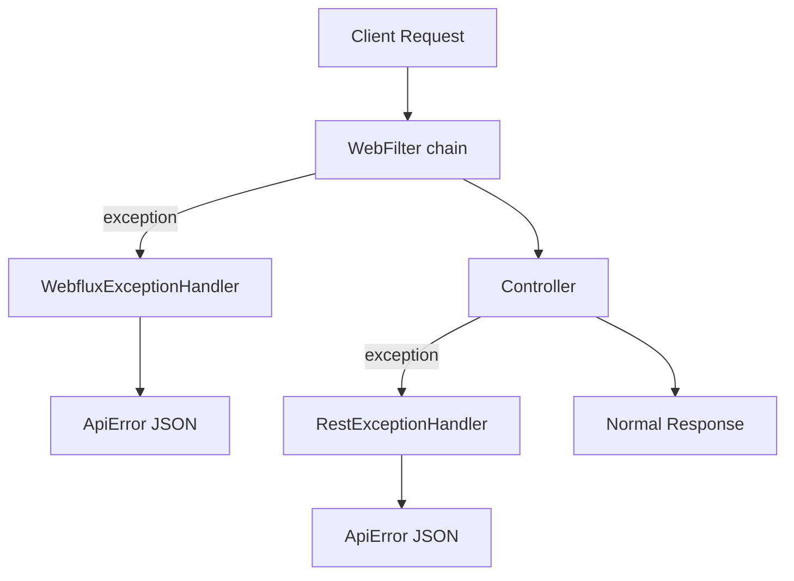

# exception-spring-boot-starter

[](https://www.apache.org/licenses/LICENSE-2.0)
[](https://mvnrepository.com/artifact/group.phorus/exception-spring-boot-starter)
[](https://codecov.io/gh/phorus-group/exception-spring-boot-starter)

Spring Boot WebFlux autoconfiguration for the Phorus exception-core library. Catches exceptions from
both controllers and WebFilters, converts them to structured JSON responses with proper HTTP status
codes, and provides built-in validation support, logging, metrics, and OpenAPI integration.

This starter depends on [exception-core](https://github.com/phorus-group/exception-core), which
provides the exception classes (`NotFound`, `BadRequest`, etc.). Adding this starter is enough
to get both.

### Notes

> The project runs a vulnerability analysis pipeline regularly,
> any found vulnerabilities will be fixed as soon as possible.

> The project dependencies are being regularly updated by [Renovate](https://github.com/phorus-group/renovate).

> The project has been thoroughly tested to ensure that it is safe to use in a production environment.

## Table of contents

- [Exception handling in Spring WebFlux](#exception-handling-in-spring-webflux)
- [Features](#features)
- [Getting started](#getting-started)
  - [Installation](#installation)
  - [Quick start](#quick-start)
- [Response format](#response-format)
  - [RFC 9457 alignment](#rfc-9457-alignment)
- [Exception classes](#exception-classes)
  - [Error codes](#error-codes)
- [Validation](#validation)
- [WebFilter exceptions](#webfilter-exceptions)
- [Logging](#logging)
- [Metrics](#metrics)
- [OpenAPI integration](#openapi-integration)
- [Building and contributing](#building-and-contributing)

---

## Exception handling in Spring WebFlux

If you are already familiar with this, feel free to skip to [Features](#features).

Spring WebFlux has two layers where exceptions can occur, and its default handling only
covers one of them.

`@RestControllerAdvice` catches exceptions thrown inside controller methods, but exceptions from
WebFilters (authentication filters, rate limiting, etc.) happen *before* the request reaches a
controller and bypass it entirely. Those produce generic framework responses with no structured
body.

On top of that, even for controller exceptions, Spring's default handling returns different formats
depending on the exception type. Validation errors, type mismatches, database constraint violations,
and business logic exceptions all produce different responses.

This library registers two handlers that cover both layers, converting every exception into a
consistent `ApiError` JSON response with the correct HTTP status code:



Everything is autoconfigured via Spring Boot's `META-INF/spring/org.springframework.boot.autoconfigure.AutoConfiguration.imports`.

## Features

- **Exception hierarchy**: throw `BadRequest("message")`, `NotFound("message")`, etc. and the correct HTTP status is set automatically. Extensible with custom subclasses.
- **Error codes**: optional `code` parameter on every exception for programmatic error identification by API clients
- **Two-layer handling**: `RestExceptionHandler` catches controller exceptions, `WebfluxExceptionHandler` catches filter and framework exceptions
- **Bean validation**: supports `@Valid` on request bodies, collections, and Kotlin `suspend` functions with correct parameter names
- **Database conflict detection**: `DataIntegrityViolationException` is caught and returned as `409 Conflict`
- **Unhandled exception safety net**: any uncaught exception returns `500` with a generic message, no stack trace leak
- **Configurable logging**: all exceptions logged at debug level, unhandled exceptions at error level
- **Optional metrics**: exception counters via [metrics-commons](https://github.com/phorus-group/metrics-commons), enabled by default when Actuator is present
- **OpenAPI integration**: automatically registers `ApiError` and `ValidationError` schemas when springdoc is on the classpath
- **Autoconfigured**: all handlers and integrations are registered via Spring Boot autoconfiguration

## Getting started

### Installation

Make sure `mavenCentral()` is in your repository list.

<details open>
<summary>Gradle / Kotlin DSL</summary>

```kotlin
implementation("group.phorus:exception-spring-boot-starter:1.0.0")
// exception-core is included transitively; no separate declaration needed
```
</details>

<details open>
<summary>Maven</summary>

```xml
<dependency>
    <groupId>group.phorus</groupId>
    <artifactId>exception-spring-boot-starter</artifactId>
    <version>1.0.0</version>
</dependency>
```
</details>

### Quick start

Add the dependency and throw exceptions from your code:

```kotlin
@RestController
class UserController(private val userService: UserService) {

    @GetMapping("/user/{id}")
    suspend fun findById(@PathVariable id: UUID): UserResponse =
        userService.findById(id) ?: throw NotFound("User with id $id not found")

    @PostMapping("/user")
    suspend fun create(@RequestBody @Valid request: CreateUserRequest): ResponseEntity<Void> {
        val id = userService.create(request)
        return ResponseEntity.created(URI.create("/user/$id")).build()
    }
}
```

If the user is not found, the client receives:

```json
{
  "timestamp": "06-03-2026 10:30:00",
  "status": 404,
  "title": "Not Found",
  "detail": "User with id 550e8400-e29b-41d4-a716-446655440000 not found"
}
```

If validation fails on the `@Valid` request body:

```json
{
  "timestamp": "06-03-2026 10:30:00",
  "status": 400,
  "title": "Bad Request",
  "detail": "Validation error",
  "validationErrors": [
    {
      "obj": "createUserRequest",
      "field": "email",
      "rejectedValue": null,
      "message": "Cannot be blank"
    }
  ]
}
```

No additional configuration is needed.

## Response format

All error responses use `application/problem+json` content type and follow this structure:

| Field | Type | Description |
|-------|------|-------------|
| `status` | `int` | HTTP status code (e.g. `400`, `404`, `500`) |
| `title` | `string` | Short label for the HTTP status (e.g. `"Bad Request"`, `"Not Found"`) |
| `detail` | `string` | Human-readable explanation of this specific error |
| `code` | `string?` | Application-specific error code for programmatic handling. Omitted when null. |
| `source` | `string?` | Service that produced the error (e.g. `"user-service"`). Auto-populated from `spring.application.name` by default. Omitted when null. |
| `metadata` | `object?` | Extra context as key-value pairs. Omitted when null. |
| `timestamp` | `string` | When the error occurred, formatted as `dd-MM-yyyy hh:mm:ss` |
| `validationErrors` | `array?` | Field-level validation details. Omitted when null. |

### RFC 9457 alignment

The response structure follows [RFC 9457 (Problem Details for HTTP APIs)](https://www.rfc-editor.org/rfc/rfc9457.html)
naming conventions. The `status`, `title`, and `detail` fields match the RFC specification.

The following RFC 9457 fields were intentionally excluded:

| RFC field | Why excluded |
|-----------|-------------|
| `type` (URI) | Intended as a dereferenceable link to documentation for the error type. In practice, most APIs never host these URIs. The `code` field serves the same programmatic identification purpose with less overhead. |
| `instance` (URI) | Identifies the specific occurrence (e.g. a request path or trace ID). The request path is already in the HTTP request, and trace IDs are better handled by distributed tracing infrastructure. |

The `code`, `source`, `metadata`, `timestamp`, and `validationErrors` fields are extensions,
which is explicitly supported by the RFC.

### Auto-populated source

When `spring.application.name` is set, the `source` field is automatically included in every
error response. This is useful in microservice architectures where errors may be forwarded or
logged by gateways. Exceptions that set `source` explicitly override the default.

To disable auto-population:

```yaml
group:
  phorus:
    exception:
      include-source: false
```

## Exception classes

The exception classes (`BadRequest`, `NotFound`, `Conflict`, etc.) are provided by
[exception-core](https://github.com/phorus-group/exception-core), which is a transitive
dependency of this starter.

All exceptions extend `BaseException(message, statusCode)` which extends `RuntimeException`.
They can be thrown from controllers, services, WebFilters, or anywhere in your code. The
handlers catch them and return the correct HTTP status code automatically.

`BaseException` is extensible: you can create custom subclasses for HTTP statuses not covered
by the 16 built-in types. See the [exception-core README](https://github.com/phorus-group/exception-core#custom-exception-classes)
for details.

### Error codes

Every exception accepts an optional `code` parameter. When provided, the error code
is included in the JSON response so API clients can programmatically identify specific errors:

```kotlin
throw BadRequest("Email format is invalid", code = "VALIDATION_EMAIL")
```

Response (assuming `spring.application.name=user-service`):

```json
{
  "timestamp": "22-03-2026 07:30:00",
  "status": 400,
  "title": "Bad Request",
  "detail": "Email format is invalid",
  "code": "VALIDATION_EMAIL",
  "source": "user-service"
}
```

With metadata:

```kotlin
throw NotFound(
    "User not found",
    code = "USER_NOT_FOUND",
    metadata = mapOf("userId" to requestedId),
)
```

Optional fields (`code`, `source`, `metadata`) are omitted from the JSON when `null`.
See the [exception-core README](https://github.com/phorus-group/exception-core#error-codes)
for more examples.

## Validation

Use `@Valid` on request body parameters with Jakarta validation annotations on your DTOs:

```kotlin
data class CreateUserRequest(
    @field:NotBlank(message = "Cannot be blank")
    val name: String?,

    @field:NotBlank(message = "Cannot be blank")
    @field:Email(message = "Invalid email format")
    val email: String?,

    @field:NotEmpty(message = "Cannot be empty")
    val subObjectList: List<SubObject>?,
)

@PostMapping("/user")
suspend fun create(@RequestBody @Valid request: CreateUserRequest) = ...
```

All validation errors are collected at once and returned in a single response. The library validates
every field, every nested object, and every collection item, then reports all violations together:

```json
{
  "timestamp": "06-03-2026 10:30:00",
  "status": 400,
  "title": "Bad Request",
  "detail": "Validation error",
  "validationErrors": [
    { "obj": "createUserRequest", "field": "name", "rejectedValue": "", "message": "Cannot be blank" },
    { "obj": "createUserRequest", "field": "email", "rejectedValue": null, "message": "Cannot be blank" },
    { "obj": "createUserRequest", "field": "subObjectList", "rejectedValue": [], "message": "Cannot be empty" }
  ]
}
```

Collections are also supported. Add `@Validated` to the controller class and `@Valid` to the
collection parameter:

```kotlin
@RestController
@Validated
class ItemController {

    @PostMapping("/items")
    suspend fun createBatch(
        @RequestBody @Valid @NotEmpty(message = "Cannot be empty")
        items: List<ItemDTO>,
    ): List<ItemResponse> = ...
}
```

The library also fixes Spring's parameter name discovery for Kotlin `suspend` functions. Spring's
default resolver gets confused by the continuation parameter, which breaks validation annotations
on suspend controller methods. The library's `WebfluxValidatorConfig` handles this transparently.

## WebFilter exceptions

`@RestControllerAdvice` only catches exceptions thrown inside controller methods. Exceptions from
WebFilters happen before the request reaches a controller, so they bypass it entirely.

The library's `WebfluxExceptionHandler` (registered with `@Order(-2)`) catches these and returns
the same `ApiError` JSON:

```kotlin
@Component
class AuthenticationFilter : WebFilter {
    override fun filter(exchange: ServerWebExchange, chain: WebFilterChain): Mono<Void> {
        val authHeader = exchange.request.headers.getFirst("Authorization")
            ?: throw Unauthorized("Authorization header is missing")

        if (!hasRequiredPermissions(parseToken(authHeader))) {
            throw Forbidden("Insufficient permissions")
        }

        return chain.filter(exchange)
    }
}
```

Without the library, these exceptions would produce generic framework responses. With it, the
client receives structured JSON:

```json
{
  "timestamp": "06-03-2026 10:30:00",
  "status": 401,
  "title": "Unauthorized",
  "detail": "Authorization header is missing"
}
```

## Logging

All caught exceptions are logged before being returned to the client. Business exceptions
(`BaseException`, validation errors, type mismatches) are logged at **debug** level. Unhandled
exceptions that fall through to the generic `Exception` handler are logged at **error** level
with full stack traces.

Configure the log level with:

```yaml
logging:
  level:
    group.phorus.exception: DEBUG
```

## Metrics

The library integrates with [metrics-commons](https://github.com/phorus-group/metrics-commons) to
record exception counters. Every caught exception increments a counter named
`http.server.exceptions` with the following tags:

| Tag | Example values |
|-----|---------------|
| `type` | `NotFound`, `BadRequest`, `RuntimeException` |
| `status_code` | `404`, `400`, `500` |
| `status_family` | `4xx`, `5xx` |

Metrics are **enabled by default** when `MeterRegistry` is on the classpath (via Spring Boot
Actuator). To disable them:

```yaml
group:
  phorus:
    exception:
      metrics:
        enabled: false
```

## OpenAPI integration

If [springdoc-openapi](https://springdoc.org/) is on the classpath, the library automatically
registers `ApiError` and `ValidationError` schemas in the OpenAPI components and adds a
`default` error response to every endpoint. This covers all error status codes with a single
entry referencing the `ApiError` schema.

## Building and contributing

See [Contributing Guidelines](CONTRIBUTING.md).

## Authors and acknowledgment

Developed and maintained by the [Phorus Group](https://phorus.group) team.
